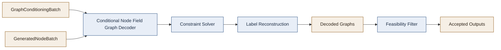
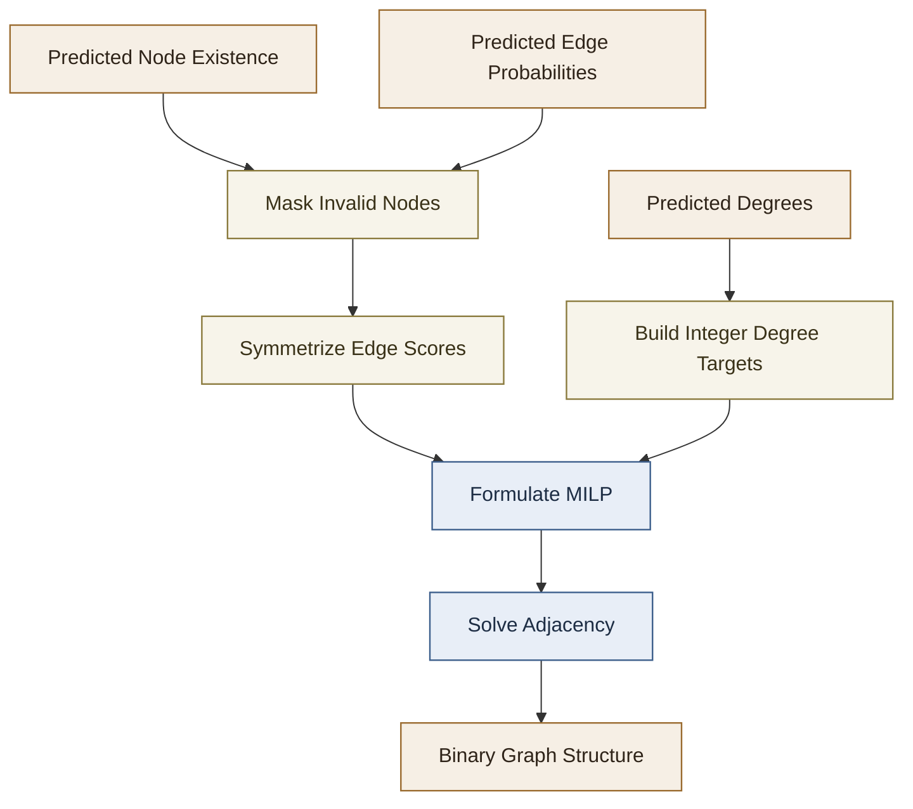

# Graph Decoder And Constraint Solver

This document explains the decoder used by `ConditionalNodeFieldGraphGenerator`, with a focus on how graph structure is reconstructed from node-generator outputs and how the constraint solver turns soft edge scores into valid adjacency matrices.

The implementation lives in [`../conditional_node_field_graph_generator/conditional_node_field_graph_generator.py`](../conditional_node_field_graph_generator/conditional_node_field_graph_generator.py), mainly inside:

- `ConditionalNodeFieldGraphDecoder`
- `ConditionalNodeFieldGraphGenerator._decode_*`

For a parameter-by-parameter interface reference, see
[`5_MAIN_CLASS_INTERFACES_README.md`](5_MAIN_CLASS_INTERFACES_README.md).

## Scope

The decoder is responsible for the second half of generation:

1. receive node-level generator outputs,
2. infer which nodes exist,
3. infer degree targets,
4. infer edge probabilities,
5. solve for a binary adjacency matrix that respects structural constraints,
6. attach node and edge labels,
7. optionally reject infeasible outputs and resample.

It is not a neural decoder in the usual sense. The neural model predicts soft graph signals, but the final graph structure is produced by a constrained combinatorial optimization step.

## High-Level Architecture

At generation time the overall flow is:

1. `ConditionalNodeFieldGraphGenerator.decode(...)` receives graph-level conditioning.
2. The conditional node generator predicts a `GeneratedNodeBatch`.
3. `ConditionalNodeFieldGraphDecoder.decode(...)` reconstructs final `networkx.Graph` objects.

The decoder operates on these predicted channels:

- `node_presence_mask`
- `node_degree_predictions`
- `node_labels` or a constant/disabled node-label policy
- `edge_probability_matrices`
- `edge_label_matrices` or a constant/disabled edge-label policy

`GeneratedNodeBatch` contains only explicit structural and semantic prediction channels. Structural decode depends on node existence, degree, and edge-probability predictions.

The supervision plan built during training determines which channels are:

- `learned`
- `constant`
- `disabled`

That matters because the decoder can fall back to constant labels without needing a learned head.

## Decoder Responsibilities

The decoder has four main jobs:

### 1. Structural Reconstruction

`decode_adjacency_matrix(...)` takes:

- predicted node existence,
- predicted node degrees,
- predicted edge probabilities,

and converts them into binary adjacency matrices.

This is the key constraint-satisfaction stage.

### 2. Node Label Reconstruction

`decode_node_labels(...)` handles node labels according to the supervision plan:

- `constant`: assign the same label to every node,
- `disabled`: assign no label,
- otherwise expect generator-provided node labels.

This is why unlabeled training graphs can still decode cleanly if the training plan collapses node labels to a constant dummy label.

### 3. Edge Label Reconstruction

`decode_edge_labels(...)` does the same for edge labels:

- use predicted edge-label matrices if available,
- otherwise assign a constant label,
- otherwise leave edges unlabeled.

### 4. Feasibility Filtering

The graph generator can optionally use a separate feasibility estimator after decoding.

If enabled:

- multiple candidate graphs are decoded per requested sample,
- each candidate is scored as feasible/infeasible,
- only accepted graphs are returned,
- rejected slots are retried up to a fixed maximum.

This is not part of the ILP itself. It is a separate post-decode rejection filter.

## Structural Decode Pipeline

The structural pipeline in `decode_adjacency_matrix(...)` is:

1. Require `node_presence_mask`.
2. Require `node_degree_predictions`.
3. Require predicted edge-probability matrices unless direct-edge reconstruction is disabled by plan.
4. Reconstruct a dense edge-probability matrix per graph.
5. Zero out all edges touching non-existent nodes.
6. Symmetrize the matrix.
7. Convert predicted degrees plus node existence into integer degree targets.
8. Solve an optimization problem that chooses the final binary adjacency matrix.

The important design choice is that the final graph is not obtained by thresholding edges independently. It is obtained by a global optimization that tries to satisfy all node degrees at once and optionally enforce connectivity.

## Why A Constraint Solver Is Needed

If the model predicts:

- node A degree 3,
- node B degree 1,
- node C degree 2,

and also predicts pairwise edge probabilities, naive thresholding can easily produce a graph that:

- violates degree targets,
- disconnects the graph,
- wastes high-confidence edges on impossible degree assignments.

The decoder therefore solves a global consistency problem:

- maximize agreement with predicted edge probabilities,
- penalize deviation from predicted degrees,
- optionally force the result to be connected.

This is the core “constraint satisfaction” step.

## The Optimization Problem

The method `optimize_adjacency_matrix(...)` formulates a mixed-integer linear optimization problem using PuLP and solves it with CBC.

### Decision Variables

For every undirected edge candidate `(i, j)` with `i < j`:

- `x_(i,j) in {0,1}`

This is the final edge decision.

For every node `i`:

- `u_i >= 0`
- `v_i >= 0`

These are degree slack variables. They allow the solver to absorb inconsistency between predicted degrees and what is graph-theoretically achievable.

If connectivity is enforced, the model also introduces:

- continuous flow variables on directed versions of the chosen undirected edges.

### Objective

The solver maximizes:

- total chosen edge probability,
- minus a large penalty for degree slack.

Conceptually:

`maximize edge_score - degree_slack_penalty * degree_violation`

So the solver prefers:

- high-probability edges,
- while strongly avoiding degree mismatches.

### Degree Constraints

For each node `i`, the sum of incident selected edges must match the target degree up to slack:

`incident_edges(i) + u_i - v_i = target_degree(i)`

This means:

- if the target degree is too high, positive slack can absorb the shortfall,
- if it is too low, slack can absorb the excess,
- but both are heavily penalized.

### Connectivity Constraints

If `enforce_connectivity=True`, the decoder adds a single-commodity flow construction.

The idea is:

- pick one root node,
- send `n-1` units of flow out of the root,
- require every other node to consume one unit,
- only allow flow through selected edges.

This forces the selected graph to be connected.

The implementation does this by:

- expanding each undirected edge into two directed flow arcs,
- constraining flow to be zero unless the corresponding edge is selected,
- enforcing balance equations at each node.

This is a standard MILP connectivity trick.

## Warm Start Strategy

If `warm_start_mst=True`, the solver receives an initial edge assignment from a maximum spanning tree over the predicted edge-probability matrix.

Why this helps:

- it gives CBC a connected, plausible initial solution,
- it biases the search toward high-probability edges,
- it can reduce solver time on noisy or ambiguous predictions.

This warm start does not replace optimization. It is just a good initial guess.

## Probability Smoothing

Before optimization, the decoder can transform edge probabilities with:

`prob_matrix = prob_matrix ** alpha`

with default `alpha = 0.7`.

This has two effects:

- compresses differences less aggressively than thresholding,
- can reshape confidence scores before they enter the objective.

It is a heuristic, not a hard probabilistic calibration step.

## Failure Handling

The decoder now validates solver outcome before reading variables.

If CBC does not return an optimal solution:

- decoding raises a `RuntimeError`.

If any decision variable is unset:

- decoding raises a `RuntimeError`.

This is important because silent fallback to invalid or partially assigned solutions would be much worse than an explicit failure.

## Label Decode Behavior

The decoder treats labels as separate channels from structure.

### Node Labels

Node labels do not participate in the adjacency ILP.

They are decoded after structure reconstruction by one of:

- using generator-predicted node labels,
- assigning a constant label from the supervision plan,
- leaving labels absent.

### Edge Labels

Edge labels are also decoded after adjacency is fixed.

This means:

- the ILP decides which edges exist,
- the edge-label decoder decides what labels those edges should receive.

So structure and semantics are coupled only loosely:

- structure is solved globally,
- labels are attached afterward.

## Feasibility Filtering

The graph generator can optionally apply a separate feasibility estimator after decoding.

This works like rejection sampling:

1. decode one or more candidate graphs for each requested slot,
2. evaluate each with `feasibility_estimator.predict(...)`,
3. accept the first feasible graph for each slot,
4. retry failed slots until either:
   - all are filled, or
   - `max_feasibility_attempts` is exhausted.

Important distinction:

- the ILP enforces structural consistency,
- the feasibility estimator enforces domain-specific validity beyond the ILP.

Examples of “feasibility” could include:

- chemistry validity,
- graph grammar compliance,
- optimization-domain admissibility.

## Decoder Limits And Tradeoffs

The decoder design is strong for small to medium graphs, but it has predictable costs.

### Strengths

- global consistency instead of local thresholding,
- explicit degree control,
- optional connectivity guarantee,
- clear separation between learned scores and hard constraints,
- easy insertion of domain-specific feasibility filters.

### Weaknesses

- MILP solve time grows quickly with graph size,
- degree predictions may still be mutually inconsistent,
- connectivity makes the solve more expensive,
- labels are not part of the structural optimization,
- feasibility filtering can require multiple full decode attempts.

In practice, this decoder is best viewed as:

- a principled constrained projection layer,
- not a general-purpose large-graph combinatorial solver.

## Typical Failure Modes

Common failure modes include:

### Infeasible Or Non-Optimal ILP

Causes:

- impossible degree targets,
- too-tight connectivity requirements,
- solver time limits.

Current behavior:

- explicit runtime failure instead of silent malformed output.

### Missing Predicted Channels

Examples:

- no node existence mask,
- no degree predictions,
- no edge probabilities when direct-edge decoding is expected.

Current behavior:

- explicit runtime failure with a targeted error message.

### Poor Structural Quality Despite Solver Success

Causes:

- weak edge probabilities,
- bad degree predictions,
- slack penalty too low,
- feasibility estimator not used when domain validity matters.

This is a modeling problem, not a solver bug.

## Tuning Guide

The most important decoder-level knobs are:

### `degree_slack_penalty`

Higher values:

- enforce degree targets more aggressively,
- but can make optimization harder or force low-probability edges.

Lower values:

- trust edge probabilities more,
- but allow degree mismatches more easily.

### `enforce_connectivity`

`True`:

- graph is forced to be connected,
- solves are slower and stricter.

`False`:

- faster and easier,
- disconnected graphs are allowed.

### `warm_start_mst`

`True`:

- usually a good default,
- gives the solver a connected high-probability seed.

### `max_feasibility_attempts`

Controls how hard the generator tries to fill all requested outputs when feasibility filtering rejects some candidates.

### `feasibility_candidates_per_attempt`

Higher values:

- increase acceptance probability per retry round,
- but increase compute cost per round.

## Suggested Mental Model

The decoder is best understood as three layers:

1. Neural prediction layer
   - soft node existence, degrees, edge probabilities, labels
2. Constraint projection layer
   - MILP chooses a globally coherent adjacency
3. Domain filtering layer
   - optional feasibility rejection and retry

This division is one of the cleaner parts of the architecture. It lets the model learn uncertain local signals while keeping final graph validity under explicit control.

## Glossary

### Adjacency Matrix

A dense `n x n` binary matrix indicating whether each undirected edge exists in the final graph.

### Auxiliary Locality

A higher-horizon pairwise supervision signal used during training as regularization. It is not itself the final adjacency.

### CBC

The default open-source MILP solver used through PuLP.

### Constraint Satisfaction

The process of choosing a final graph that respects hard or strongly penalized conditions such as degree targets and connectivity.

### Degree Slack

Non-negative auxiliary variables that absorb mismatch between predicted node degree and achievable degree in the final graph.

### Direct Edges

The horizon-1 edge-presence channel used by the decoder as the main structural signal.

### Feasibility Estimator

A separate model or rule system that decides whether a decoded graph is acceptable for the target domain.

### Flow Constraints

A MILP technique used to enforce graph connectivity by routing artificial flow through selected edges.

### GeneratedNodeBatch

The node generator’s output object containing predicted structural and semantic channels.

### MILP

Mixed-Integer Linear Programming. The optimization framework used to reconstruct adjacency matrices.

### Supervision Plan

The graph-level training-time plan that decides whether each prediction channel is learned, constant, or disabled.

### Warm Start

An initial candidate solution given to the solver before optimization begins. Here it is derived from a maximum spanning tree over edge probabilities.
