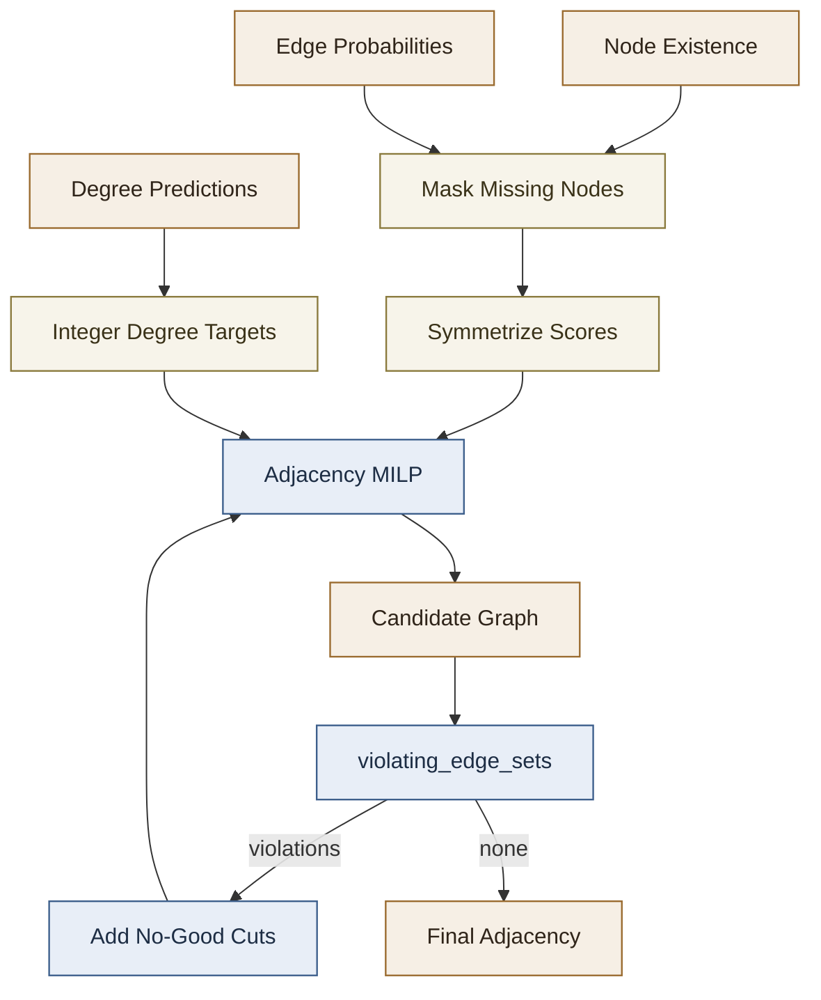

# Graph Decoder, Separation Oracle, And Constraint Solver

This document explains the reconstruction stage used by
`ConditionalNodeFieldGraphGenerator`.

The key idea is:

- the neural model predicts soft structural signals,
- the decoder projects those signals into a discrete graph with either a MILP
  strategy or a direct neural-probability strategy,
- an optional feasibility estimator can now participate twice:
  - inside the structural solve as a separation oracle through
    `violating_edge_sets(...)`,
  - after decode as a post-hoc accept or reject filter through `predict(...)`.

The canonical decoder implementation lives in
[`../conditional_node_field_graph_generator/conditional_node_field_graph_decoder.py`](../conditional_node_field_graph_generator/conditional_node_field_graph_decoder.py).

The public class is a façade over focused implementation modules:

- `structural_decoder.py` owns active-node MILP projection, horizon separation,
  incumbent validation, and solve reports,
- `direct_graph_decoder.py` owns non-MILP edge selection,
- `decoder_assembly.py` owns label validation and final graph assembly,
- `oracle_decode.py` owns oracle-guided decode orchestration.

The graph generator orchestrates around that decoder in
[`../conditional_node_field_graph_generator/conditional_node_field_graph_generator.py`](../conditional_node_field_graph_generator/conditional_node_field_graph_generator.py),
mainly through:

- `ConditionalNodeFieldGraphDecoder`
- `ConditionalNodeFieldGraphGenerator._decode_*`

Public imports should therefore use:

```python
from conditional_node_field_graph_generator import ConditionalNodeFieldGraphDecoder
```

For the full interface reference, see
[`4_MAIN_CLASS_INTERFACES_README.md`](4_MAIN_CLASS_INTERFACES_README.md).

## Scope

The decoder is responsible for the second half of generation:

1. receive node-level generator outputs,
2. reconstruct a valid binary adjacency matrix,
3. optionally add feasibility-driven no-good cuts and re-solve,
4. attach node and edge labels,
5. optionally run post-decode feasibility filtering and retries.

It is not a neural decoder in the usual sense.

The neural model predicts:

- node existence,
- node degrees,
- edge probabilities,
- node labels,
- edge labels.

The decoder then performs constrained combinatorial reconstruction.

## High-Level Architecture

At generation time the overall flow is:

1. `ConditionalNodeFieldGraphGenerator.decode(...)` receives graph-level conditioning.
2. The conditional node generator predicts a `GeneratedNodeBatch`.
3. Structural decode uses the ILP strategy by default, or the direct strategy
   when `use_ilp_decoder=False`.
4. If enabled and ILP decoding is active, a feasibility oracle adds no-good cuts
   and the MILP is re-solved.
5. Labels are attached to the final adjacency.
6. If enabled, feasibility filtering accepts or rejects decoded graphs and may retry.

If `max_feasibility_seconds_per_sample` is set on the graph generator, this
retry loop is evaluated per requested output with its own timeout budget. In
that mode, the final fallback or rejection behavior is controlled by
`feasibility_rejection_mode`.

Direct structural decoding is intentionally factored as its own strategy: it
selects top-k edges when desired edge counts are available and thresholded edges
otherwise. It still uses the same node-presence resolution, edge-label assembly,
and graph construction path as ILP decoding. Degree-aware direct selection
always reconciles its candidates to the requested feasible edge count; degree
matching is secondary when the two disagree.


```mermaid
flowchart LR
    GC[GraphConditioningBatch]
    GNB[GeneratedNodeBatch]
    STR[Structural Decode]
    ORA[Separation Oracle Loop]
    LAB[Label Reconstruction]
    DEC[Decoded Graphs]
    FIL[Feasibility Filtering]
    OUT[Returned Graphs]

    GC --> GNB
    GNB --> STR --> ORA --> LAB --> DEC --> FIL --> OUT

    classDef data fill:#f6efe5,stroke:#9a6b2f,stroke-width:1.2px,color:#2f2419;
    classDef decode fill:#e8eef7,stroke:#3d5f8c,stroke-width:1.2px,color:#1d2d44;
    classDef process fill:#f7f4ea,stroke:#8a7a3d,stroke-width:1.2px,color:#3a3218;

    class GC,GNB,DEC,OUT data;
    class STR,ORA,LAB,FIL decode;
```

The important architectural change is that feasibility is no longer only a
post-hoc rejection stage. When the estimator exposes `violating_edge_sets(...)`,
it can actively shape the decoded adjacency before the graph is finalized.

## Decoder Inputs

The decoder operates on these predicted channels:

- `node_presence_mask`
- `node_degree_predictions`
- `edge_probability_matrices`
- `horizon_probability_matrices` when auxiliary locality was trained with
  `locality_horizon > 1`
- `node_labels` or a constant or disabled node-label policy
- `edge_label_matrices` or a constant or disabled edge-label policy

`GeneratedNodeBatch` contains explicit prediction channels only. The supervision
plan built during training tells the generator and decoder whether each channel
is:

- `learned`
- `constant`
- `disabled`

That is why unlabeled datasets can still decode cleanly. The decoder can attach
constant dummy labels or no labels at all without requiring a learned label
head.

`GeneratedNodeBatch` may also carry richer full-shape distribution tensors such
as `node_label_logits`, `node_label_probabilities`,
`edge_existence_probabilities`, `horizon_probability_matrices`,
`edge_label_logits`, and `edge_label_probabilities`. In the standard ILP path,
direct edge probabilities remain the primary structural signal. When
`horizon_probability_matrices` are present and the horizon is greater than one,
the decoder also uses them as soft path constraints. In the oracle-guided path,
the richer probability tensors are also used to score candidates and repair node
or edge labels between structural re-solves.

## Decoder Responsibilities

The decoder has four main jobs.

### 1. Structural Reconstruction

`decode_adjacency_matrix(...)` takes:

- node existence predictions,
- node degree predictions,
- edge probability matrices,
- optional higher-horizon locality probability matrices,

and turns them into binary adjacency matrices.

This is the core global-consistency step.

### 2. Oracle-Guided Cut Generation

When the configured feasibility estimator exposes oracle hooks and the current
attempt is still within the
`feasibility_oracle_candidates_per_attempt` budget, the generator runs a
bounded oracle-guided loop:

- solve the current adjacency MILP,
- materialize the candidate graph,
- ask the feasibility estimator for violating edge or node sets,
- optionally accumulate the currently offending node-label or edge-label
  assignments as relabeling constraints,
- propose a node-label repair andor edge-label repair using the predicted label
  probabilities,
- accept a relabeling proposal only if it improves the full oracle state rather
  than treating label repair as an independent stage,
- allocate a per-estimator structural-cut budget,
- add one no-good cut per selected persistent violating edge set,
- re-solve until no new violations remain or the iteration budget is exhausted.

For the maintained demo feasibility estimator, violating edge sets are grouped
by internal estimator level, such as edge, path, valence, and cycle checks.
The oracle now uses an adaptive budget policy by default:

- start from a decreasing prior budget for smaller-to-larger motif families,
- inspect how many violating edge sets each active estimator produced on the
  current candidate graph,
- keep each estimator up to its base allocation,
- reassign unused budget from quieter levels to levels that still expose
  additional violations.

This is adaptive reallocation around a decreasing prior, not a learned policy.
The estimator interface also supports boolean masks so one-hot or cumulative
subsets of internal estimator levels can be activated for ablations or staged
decode experiments.

### 3. Label Reconstruction

`decode_node_labels(...)` and `decode_edge_labels(...)` attach semantics after
the final adjacency is fixed.

### 4. Optional Post-Decode Filtering

The graph generator can still apply rejection sampling after decode:

- score each decoded graph with `feasibility_estimator.predict(...)`,
- keep feasible outputs,
- retry missing slots for a bounded number of rounds.

This remains separate from the MILP and the separation-oracle loop.

## Structural Decode Pipeline

The structural pipeline is:

1. require `node_presence_mask`,
2. require `node_degree_predictions`,
3. require `edge_probability_matrices`,
4. reconstruct one dense edge-probability matrix per graph,
5. zero out edges touching non-existent nodes,
6. symmetrize the matrix,
7. convert predicted degrees plus node existence into integer degree targets,
8. project the problem to active node slots and solve the adjacency MILP,
9. optionally run the oracle loop, which may relabel, add feasibility cuts, and
   re-solve.

Inactive padded slots never participate in degree, edge-count, connectivity,
forbidden-motif, warm-start, or horizon constraints. The active adjacency is
expanded back to the original padded shape only after solving.


```mermaid
flowchart TD
    EX[Node Existence]
    DEG[Degree Predictions]
    PROB[Edge Probabilities]
    MASK[Mask Missing Nodes]
    SYM[Symmetrize Scores]
    TGT[Integer Degree Targets]
    MILP[Adjacency MILP]
    G1[Candidate Graph]
    ORA[violating_edge_sets]
    CUTS[Add No-Good Cuts]
    FINAL[Final Adjacency]

    EX --> MASK
    PROB --> MASK --> SYM --> MILP
    DEG --> TGT --> MILP
    MILP --> G1 --> ORA
    ORA -->|violations| CUTS --> MILP
    ORA -->|none| FINAL

    classDef data fill:#f6efe5,stroke:#9a6b2f,stroke-width:1.2px,color:#2f2419;
    classDef process fill:#f7f4ea,stroke:#8a7a3d,stroke-width:1.2px,color:#3a3218;
    classDef decode fill:#e8eef7,stroke:#3d5f8c,stroke-width:1.2px,color:#1d2d44;

    class EX,DEG,PROB,G1,FINAL data;
    class MASK,SYM,TGT process;
    class MILP,ORA,CUTS decode;
```

The crucial design choice is unchanged:

- the final graph is not produced by thresholding edges independently,
- it is produced by a global optimization that tries to satisfy all degree and
  connectivity requirements together.

The new piece is that feasibility can now reject not just whole graphs after the
fact, but specific realized edge motifs during reconstruction.

## Why A Constraint Solver Is Needed

Suppose the model predicts:

- one node should have degree 3,
- another should have degree 1,
- another should have degree 2,
- and several pairwise edges all look plausible.

Naive thresholding can easily produce a graph that:

- violates degree targets,
- disconnects the graph,
- spends degree budget on mutually incompatible high-probability edges.

The decoder therefore solves a global consistency problem:

- maximize agreement with predicted edge probabilities,
- penalize deviation from predicted degrees,
- optionally force connectivity,
- optionally satisfy high-confidence higher-horizon locality predictions through
  soft path constraints,
- optionally forbid exact violating motifs returned by the feasibility oracle.

## The Optimization Problem

`optimize_adjacency_matrix(...)` formulates a mixed-integer linear program using
PuLP and solves it with CBC.

### Decision Variables

For every undirected edge candidate `(i, j)` with `i < j`:

- `x_(i,j) in {0,1}`

This is the binary edge decision.

For every node `i`:

- `u_i >= 0`
- `v_i >= 0`

These are degree slack variables. They absorb inconsistency between predicted
degrees and what is graph-theoretically achievable.

If connectivity is enforced, the model also introduces:

- continuous flow variables on directed versions of the selected undirected
  edges.

### Objective

The solver maximizes:

- total selected edge probability,
- minus a large penalty for total degree slack.
- minus an optional linear penalty for edge-count deviation.
- minus soft slack penalties for violated horizon-locality constraints when
  horizon-aware ILP decoding is active.

Conceptually:

`maximize edge_score - degree_penalty * degree_slack - edge_count_penalty * edge_count_slack - horizon_penalty * horizon_slack`

So the solver prefers:

- high-probability edges,
- while strongly discouraging degree mismatch.

### Horizon-Aware Soft Path Constraints

When auxiliary locality supervision is active, the node generator predicts
`P(dist(i, j) <= K)` for ordered node pairs. The decoder symmetrizes those
scores, keeps only high-confidence active-node pairs, and adds soft constraints
to the adjacency MILP.

For positive horizon pairs, the decoder uses deterministic best-first
enumeration of simple paths of length at most `K`, ranked by the product of
their direct-edge probabilities. Enumeration is bounded by
`horizon_path_expansion_budget`; truncation is soft and reported. It then adds binary
path activation variables and a pair slack variable so the ILP is rewarded for
realizing at least one short path without making the problem infeasible.

For negative horizon pairs, the decoder first solves the ordinary/positive
augmented MILP, detects realized short paths that contradict low horizon
probabilities, adds soft path-breaking cuts, and re-solves until convergence,
iteration exhaustion, or expiration of the shared time budget. Unresolved pairs
remain soft and are returned with an explicit solve-report count.

This is enabled by default on the decoder, but it only activates when
`GeneratedNodeBatch.horizon_probability_matrices` is present and
`GeneratedNodeBatch.horizon > 1`.

### Degree Constraints

For each node `i`:

`incident_edges(i) + u_i - v_i = target_degree(i)`

This means:

- positive slack can absorb missing degree,
- opposite slack can absorb excess degree,
- but both are expensive.

### Connectivity Constraints

If `enforce_connectivity=True`, the decoder adds a single-commodity flow
construction.

The idea is:

- choose one root node,
- send `n - 1` units of flow out of the root,
- require every other node to consume one unit,
- allow flow only through selected edges.

This forces the selected graph to be connected.

### Oracle Cuts

If the feasibility oracle returns violating edge sets
`S_1, S_2, ..., S_K`, the decoder adds one no-good cut per persistent set:

`sum(x_e for e in S_k) <= |S_k| - 1`

Interpretation:

- the exact violating motif may not reappear,
- any strict subset of its edges is still allowed,
- the MILP never needs to know what the motif means semantically.

The decoder canonicalizes and deduplicates these edge sets before adding them,
so reversed undirected edges and duplicate cuts do not create redundant
constraints.

## Oracle Loop Semantics

The separation oracle is implemented at the generator level around the decoder.

For one graph:

1. decode an adjacency matrix,
2. attach the currently implied labels,
3. materialize a `networkx.Graph`,
4. query the feasibility estimator for violating edge sets and, when supported,
   violating node sets,
5. when `number_of_violations(...)` is available, batch-test localized labelled
   additions between nodes touched by each violating edge set,
6. immediately adopt the best addition that strictly reduces total violations,
7. otherwise record newly discovered forbidden node-label or edge-label assignments,
8. try soft node-label and edge-label repair proposals against the current
   structure,
9. keep a proposal only if it improves the full oracle state,
10. add newly discovered persistent structural cuts,
11. re-run the structural solve if needed.

Important points:

- oracle-guided decode is activated by estimator capability plus the
  `feasibility_oracle_candidates_per_attempt` budget for the current retry
  attempt,
- `violating_edge_sets(...)` is optional,
- if the required oracle hooks are missing, NodeField falls back to the older
  one-shot decode path,
- the loop is bounded by `max_oracle_iterations`,
- constructive edge additions are limited by `oracle_add_edge_repair_budget`
  and use one batched feasibility-estimator call per round,
- labels are still reconstructed outside the MILP itself, but may now be
  repaired between structural solves as soft follow-up moves,
- structural cuts only encode violating edge motifs; node and edge-label
  violations are handled through forbidden assignments plus accepted relabeling
  proposals,
- post-decode feasibility filtering may still reject the final graph.

So the oracle improves structural decode, but it does not replace the rest of
the generation pipeline.

## Warm Start And Probability Shaping

### Warm Start

If `warm_start_mst=True`, the solver receives an initial edge assignment from a
maximum spanning tree built from the edge-probability matrix.

Why this helps:

- it gives CBC a connected plausible starting point,
- it biases the initial solution toward high-probability edges,
- it can reduce solve time on noisy predictions.

This does not replace optimization. It is just a seed.

### Probability Smoothing

Before optimization, the decoder may transform edge probabilities with:

`prob_matrix = prob_matrix ** alpha`

with default `alpha = 0.7`.

This is a heuristic reshaping step, not a calibrated probabilistic correction.

## Failure Handling

The decoder prefers explicit failure over silent malformed output.

If CBC does not return an optimal solution:

- decoding raises a `RuntimeError`.

If any decision variable is unset:

- decoding raises a `RuntimeError`.

If required channels are missing:

- decoding raises a targeted error message explaining which prediction channel is
  absent.

This is especially important for oracle-guided decode, because it is better to
fail loudly than to continue after a partial or inconsistent structural solve.

## Label Reconstruction

Labels are treated as separate channels from structure.

### Node Labels

Node labels do not participate in the adjacency MILP.

They are reconstructed after structure by:

- using generator-predicted node labels,
- assigning a constant label from the supervision plan,
- or leaving labels absent.

In oracle-guided decode, node labels may also be revised between structural
solves when node-label probabilities are available and the estimator reports
violating node sets.

### Edge Labels

Edge labels are also reconstructed after adjacency is fixed.

This means:

- the MILP decides which edges exist,
- the edge-label decoder decides what labels to assign to those realized edges.

So semantics are attached to a graph whose structure has already been chosen.
In oracle-guided decode, edge labels may also be repaired between structural
solves before deciding whether a structural re-solve is still needed.

## Feasibility Filtering After Decode

The graph generator can optionally apply a separate feasibility estimator after
decode.

This works like rejection sampling:

1. decode one or more candidate graphs for each requested slot,
2. evaluate each with `feasibility_estimator.predict(...)`,
3. accept feasible candidates,
4. retry unfilled slots until all are filled or
   `max_feasibility_attempts` is exhausted.

This stage remains useful even when the oracle is enabled:

- the oracle forbids specific known violating motifs,
- post-hoc filtering still checks whole-graph domain validity,
- some violations may remain if the estimator cannot localize them into edge
  sets,
- the oracle loop may stop at its iteration budget before all violations are
  eliminated.

## Feasible-Rate Score

`ConditionalNodeFieldGraphGenerator.score_feasible_rate(...)` measures how often
the full decode-plus-filtering stage yields feasible candidates.

The main returned quantity is:

- `score = feasible_rate`

where:

- `feasible_rate = feasible_candidates / generated_candidates`

This is useful for hyperparameter search only when the retry budget is held
fixed across runs:

- `max_feasibility_attempts`
- `feasibility_candidates_per_attempt`
- `n_samples`

Otherwise the score changes partly because the decoder is being allowed a
different amount of search effort.

## Decoder Strengths And Tradeoffs

### Strengths

- global consistency instead of local thresholding,
- explicit degree control,
- optional connectivity guarantee,
- optional oracle-guided exclusion of exact violating motifs,
- clear separation between learned scores and hard constraints,
- compatibility with post-hoc domain filtering.

### Weaknesses

- MILP solve time grows quickly with graph size,
- connectivity makes solves more expensive,
- degree predictions can still be mutually inconsistent,
- oracle-guided decode may require multiple full ILP solves per graph,
- labels are not optimized jointly with structure,
- feasibility filtering can still require multiple full decode attempts.

In practice, the decoder is best viewed as:

- a constrained projection layer for small to medium graphs,
- not a general-purpose large-graph combinatorial solver.

Horizon-aware ILP adds more variables and may trigger one extra solve for
negative path cuts. Use smaller pair/path budgets when decode latency matters.

## Suggested Mental Model

The decoder is easiest to reason about as four layers:

1. Neural prediction layer
   Soft node existence, degree, edge-probability, and label signals.
2. Constraint projection layer
   MILP chooses a globally coherent adjacency.
3. Oracle refinement layer
   Optional feasibility cuts exclude realized violating motifs.
4. Domain acceptance layer
   Optional feasibility filtering accepts, rejects, and retries complete graphs.

That division is one of the stronger parts of the architecture. It lets the
neural model remain soft and uncertain while keeping final structural validity
under explicit control.

## Glossary

### Adjacency Matrix

A dense `n x n` binary matrix indicating which undirected edges exist.

### CBC

The default open-source MILP solver used through PuLP.

### Degree Slack

Non-negative auxiliary variables that absorb mismatch between predicted degree
and achievable degree.

### Direct Edges

The horizon-1 edge-presence channel used as the main structural signal.

### Horizon Locality

The auxiliary higher-horizon prediction channel for whether two nodes should be
within `K` graph hops. The decoder can use this as soft path guidance in the
adjacency MILP.

### Feasibility Estimator

A separate model or rule system that evaluates whether a decoded graph is valid
for the target domain.

### Flow Constraints

A MILP trick that enforces connectivity by routing artificial flow through
selected edges.

### GeneratedNodeBatch

The conditional node generator output object containing predicted structural and
semantic channels.

### MILP

Mixed-Integer Linear Programming, the optimization framework used for adjacency
reconstruction.

### Separation Oracle

An interface that inspects a decoded graph, returns violating edge sets, and
thereby allows the solver to add no-good cuts without encoding the domain rule
directly inside the MILP.

### Supervision Plan

The training-time plan that decides whether each channel is learned, constant,
or disabled.

### Warm Start

An initial candidate solution given to the MILP solver before optimization
begins.
