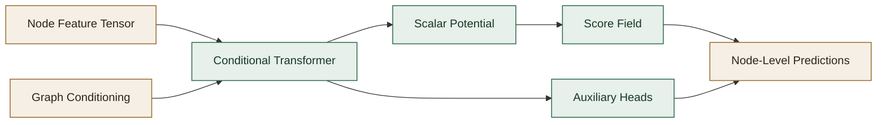
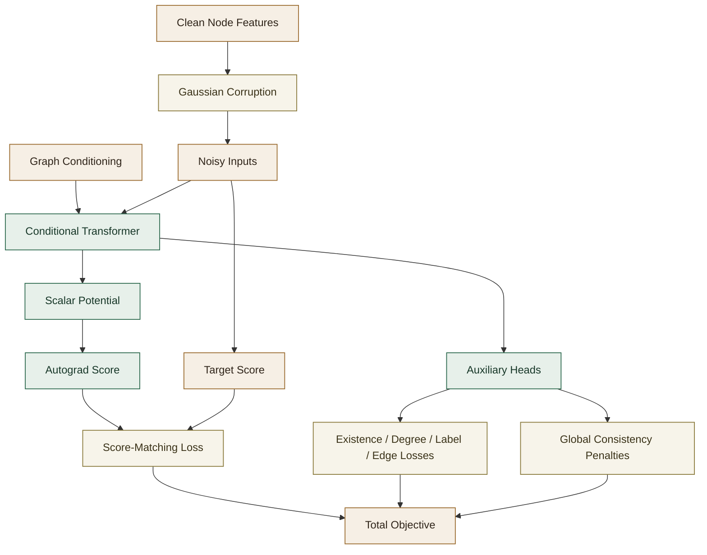

# Conditional Node Field Generator

This document explains the `ConditionalNodeFieldGenerator` implemented in this repository, what equations it uses during training and sampling, and how the surrounding graph-generation pipeline fits together.

The implementation lives primarily in
[`../conditional_node_field_graph_generator/conditional_node_field_generator.py`](../conditional_node_field_graph_generator/conditional_node_field_generator.py).

## Overview

The maintained node generator in this repository is:

- `ConditionalNodeFieldGenerator`
  A stationary, energy-based conditional generator for graph-conditioned node synthesis.

The Conditional Node Field model replaces diffusion time-conditioning and reverse-time denoising with:

- a scalar conditional energy or potential,
- a score field obtained as the gradient of that scalar,
- a stationary score-matching objective,
- iterative relaxation or Langevin-style sampling in feature space.

In this repository, the Conditional Node Field generator is used as the `conditioning -> node-level predictions` stage inside the broader decompositional pipeline:

1. encode each training graph into node feature matrices and graph-level conditioning vectors,
2. train the Conditional Node Field generator to map graph-level conditions to node-level structural and semantic predictions,
3. use the model heads and graph decoder to map generated node-level predictions back into graphs.



## High-Level Idea

Diffusion models learn a time-dependent denoising field:

$$
\epsilon_\theta(x_t, c, t)
$$

or equivalently a time-dependent score field.

The Conditional Node Field model implemented here learns a stationary conditional score field:

$$
g_\theta(x, c)
$$

where:

- $x$ is a padded node-feature tensor for one graph,
- $c$ is the graph-level conditioning input,
- $g_\theta$ is constrained to be integrable because it comes from a scalar potential.

Instead of directly outputting a vector field, this implementation defines a scalar conditional potential:

$$
\phi_\theta(x, c)
$$

and obtains the score field by differentiation:

$$
g_\theta(x, c) = - \nabla_x \phi_\theta(x, c)
$$

This means the learned field is conservative by construction.

## Energy-Based View

The conceptual target is a conditional energy-based model:

$$
p_\theta(x \mid c) \propto \exp(-E_\theta(x, c))
$$

with:

$$
E_\theta(x, c) \equiv \phi_\theta(x, c)
$$

Then:

$$
\nabla_x \log p_\theta(x \mid c) = -\nabla_x E_\theta(x, c)
$$

and because this code uses $E_\theta = \phi_\theta$, the implemented score field is:

$$
g_\theta(x, c) = -\nabla_x \phi_\theta(x, c)
$$

This is the field that drives both training and generation.

## What the Model Predicts

The Conditional Node Field module does not directly output node features. It outputs:

1. a scalar conditional potential through `potential_head`,
2. a score field through autograd,
3. auxiliary head predictions for:
   - node existence,
   - node degree,
   - optional locality supervision.

So the primary generative object is the score:

$$
g_\theta(x, c)
$$

not a reconstruction vector and not a diffusion residual.

Node existence should be interpreted as a learned occupancy process over node slots. In this repository, the global node count is conditioned explicitly, but the model still learns which specific slots should materialize. That allows generation to stay gradual: several candidate node slots can remain plausible early in sampling and only later coalesce into a committed support set.

## Inputs and Outputs

### Inputs

For a batch of graphs, the Conditional Node Field module consumes:

- `input_examples`
  Shape $(B, N, D)$, padded node features.
- `global_condition`
  Shape $(B, C)$ or $(B, M, C)$, graph-level conditioning vectors or tokens.
- explicit graph-size channels inside the conditioning input, including node count and edge count.
- `node_mask`
  Shape $(B, N)$, boolean mask indicating valid node slots.

The important distinction is:

- the conditioned node count is a global cardinality target,
- `node_mask` is the per-slot realization of that target.

Those are not equivalent. A scalar count does not identify which latent node positions are active, and the Conditional Node Field dynamics are free to explore alternative support sets before settling on a final one.

At training time, if node-label supervision is enabled, the model receives explicit
per-node categorical targets rather than a graph-level label-composition summary.

### Outputs

At inference time, the wrapper returns:

- a list of generated node-feature matrices in original feature scale,
- optionally with degree channel overwritten by the auxiliary degree head,
- and node existence channel snapped using the existence head.

Additionally, if node-label supervision is enabled, the wrapper stores the per-node
predicted categorical labels from the final latent state in:

```python
conditional_node_field_generator.last_predicted_node_label_classes_
```

These labels are not written directly into the node-feature tensor because node labels
are categorical metadata, not continuous feature channels in the Conditional Node Field state.

## Data Preprocessing

The wrapper preserves the established preprocessing behavior:

- node-feature tensors are padded to a common maximum node count,
- node features are scaled with `MinMaxScaler`,
- conditional features are scaled separately,
- degree scaling statistics are stored so discrete degree labels can be recovered,
- padded positions are masked during Conditional Node Field training and attention.

This matters because the Conditional Node Field model operates in scaled feature space, while the downstream decoder expects outputs back in the original feature space.

It also matters generatively: padding is not just a batching convenience. It provides a larger latent support over which the model can express tentative node occupancy decisions before the existence process sharpens into a final graph.

## Model Architecture

The Conditional Node Field generator uses a conditional transformer backbone:

1. node features are layer-normalized,
2. node features are projected into a latent dimension,
3. graph-level conditions are projected into the same latent space,
4. node tokens attend to condition tokens through stacked cross-transformer layers,
5. latent node tokens are converted into a scalar potential and auxiliary predictions.

### Backbone

Let:

- $x \in \mathbb{R}^{B \times N \times D}$ be node features,
- $c \in \mathbb{R}^{B \times M \times C}$ be condition tokens,
- $h \in \mathbb{R}^{B \times N \times H}$ be latent node tokens.

The encoder computes:

$$
h = f_\theta(x, c)
$$

using learned linear projections and repeated cross-attention blocks.

### Potential

Each latent node token contributes a scalar:

$$
\phi_i = \mathrm{MLP}(h_i)
$$

and the graph-level scalar potential is the masked sum:

$$
\phi_\theta(x, c) = \sum_{i=1}^{N} m_i \, \phi_i
$$

where $m_i \in \{0, 1\}$ is the node mask.

### Score

The score is computed by differentiating the scalar potential with respect to the input node features:

$$
g_\theta(x, c) = -\nabla_x \phi_\theta(x, c)
$$

This is done with PyTorch autograd in the implementation.

## Core Conditional Node Field Training Objective

The basic training construction is Gaussian corruption of clean data.

Given clean node features:

$$
x
$$

sample Gaussian noise:

$$
\varepsilon \sim \mathcal{N}(0, I)
$$

and define noisy inputs:

$$
\tilde{x} = x + \sigma \varepsilon
$$

### Target Score

Using denoising score-matching logic, the target field for Gaussian corruption is:

$$
g^*(\tilde{x}) = - \frac{\varepsilon}{\sigma}
$$

This is also the implementation target score.

### Conditional Node Field Loss Used Here

The implementation minimizes masked mean squared error between learned score and target score:

$$\mathcal{L}_{\mathrm{node\_field}} = \mathbb{E}_{x,\varepsilon}\left[\left\|g_\theta(\tilde{x}, c) + \frac{\varepsilon}{\sigma}\right\|^2\right]$$

with masking applied to padded node positions.

Expanded with mask $m$:

$$\mathcal{L}_{\mathrm{node\_field}} = \frac{\sum_{b,i,d} m_{b,i}\left(g_\theta(\tilde{x}, c)_{b,i,d} + \frac{\varepsilon_{b,i,d}}{\sigma}\right)^2}{\sum_{b,i,d} m_{b,i}}$$

This is the primary generative loss in the current code.

## Denoised Estimate

After learning the score on noisy inputs, the implementation forms a denoised estimate:

$$
\hat{x} = \tilde{x} + \sigma^2 g_\theta(\tilde{x}, c)
$$

This is a feature-wise version of the usual denoising correction.

That estimate is then reused for auxiliary supervised heads.

## Auxiliary And Structural Losses

The Conditional Node Field generator is not only trained to learn a conditional energy landscape. It also predicts graph-structural properties through supervised heads and soft global consistency terms.



The complete loss is easiest to understand as a sum of three groups:

1. generative score matching,
2. local supervised heads,
3. graph-level soft consistency penalties.

### 1. Conditional Node Field Score Loss

This is the main generative term:

$$
\mathcal{L}_{\mathrm{node\_field}}
$$

It teaches the model’s score field to match the denoising score implied by Gaussian corruption.

Operationally:

- acts on every valid feature dimension of every valid node,
- is masked over padded rows,
- is always present.

This term is logged as:

- `node_field`

### 2. Node Existence Loss

The existence target is the true node-support mask:

$$
y^{\mathrm{exist}}_{b,i} \in \{0, 1\}
$$

The existence head predicts logits:

$$
\ell^{\mathrm{exist}}_{b,i}
$$

and the implementation applies binary cross-entropy with logits:

$$
\mathcal{L}_{\mathrm{exist}} = \mathrm{BCEWithLogits}(\ell^{\mathrm{exist}}, y^{\mathrm{exist}})
$$

with positive-class reweighting through `exist_pos_weight`.

Important detail:

- this loss is evaluated on all padded slots, not only valid nodes,
- real nodes act as positives,
- padded rows act as true negatives.

That means this term does two jobs:

- teaches occupancy,
- teaches the model not to materialize padded slots.

This term is logged as:

- `exist`

If all training graphs have the same node count and the existence target is constant, the implementation disables the existence head and drops this term.

### 3. Node Count Loss

This is a soft global consistency term built on top of the existence head.

The conditioning vector contains an explicit desired node count:

$$
n^{\mathrm{target}}_b
$$

The model’s existence logits imply an expected number of materialized nodes:

$$
\hat{n}_b = \sum_i \sigma(\ell^{\mathrm{exist}}_{b,i})
$$

The implementation penalizes disagreement with a Huber loss:

$$
\mathcal{L}_{\mathrm{node\_count}} =
\mathrm{Huber}(\hat{n}_b, n^{\mathrm{target}}_b)
$$

This term is useful because the per-slot BCE loss does not by itself guarantee that the total occupancy mass matches the desired graph size.

This term is logged as:

- `node_count_loss`

and weighted by:

- `lambda_node_count_importance`

### 4. Degree Classification Loss

The degree target is the true node degree clipped to the supported class range:

$$
y^{\mathrm{deg}}_{b,i} \in \{0, \dots, D_{\max}\}
$$

The degree head predicts logits:

$$
\ell^{\mathrm{deg}}_{b,i} \in \mathbb{R}^{D_{\max}+1}
$$

and the implementation applies masked cross-entropy:

$$
\mathcal{L}_{\mathrm{deg}} =
\mathrm{MaskedCrossEntropy}(\ell^{\mathrm{deg}}, y^{\mathrm{deg}})
$$

Masking means:

- only materialized nodes contribute,
- padded rows do not contribute.

This term is logged as:

- `deg_ce`

and weighted by:

- `lambda_degree_importance`

### 5. Node Label Loss

If node labels are supervised and not collapsed to a constant, the node-label head predicts categorical logits:

$$
\ell^{\mathrm{label}}_{b,i} \in \mathbb{R}^{K}
$$

for encoded node-label targets:

$$
y^{\mathrm{label}}_{b,i} \in \{0, \dots, K-1\}
$$

The loss is masked cross-entropy:

$$
\mathcal{L}_{\mathrm{label}} =
\mathrm{MaskedCrossEntropy}(\ell^{\mathrm{label}}, y^{\mathrm{label}})
$$

Only valid nodes contribute.

This term is logged as:

- `node_label_ce`

and weighted by:

- `lambda_node_label_importance`

If node labels are constant or disabled by the supervision plan, this term is absent.

### 6. Direct Edge Locality Loss

If direct edge supervision is enabled, the model scores selected node pairs with an edge MLP:

$$
\ell^{\mathrm{edge}}_{(i,j)} = f_{\mathrm{edge}}(h_i, h_j)
$$

and applies BCE with logits against direct edge-presence targets:

$$
\mathcal{L}_{\mathrm{edge}} =
\mathrm{BCEWithLogits}(\ell^{\mathrm{edge}}, y^{\mathrm{edge}})
$$

This is the main structural pairwise supervision term used by the decoder path.

This term is logged as:

- `edge_ce`

and weighted by:

- `lambda_direct_edge_importance`

### 7. Edge Count Loss

This is a soft global consistency term on the full soft adjacency field.

From the dense edge-probability matrix:

$$
P_{b,ij}
$$

the implementation forms a symmetrized expected undirected edge count:

$$
\hat{m}_b = \sum_{i < j} \frac{P_{b,ij} + P_{b,ji}}{2}
$$

restricted to currently materialized node slots.

The conditioning vector contains a desired edge count:

$$
m^{\mathrm{target}}_b
$$

and the loss is:

$$
\mathcal{L}_{\mathrm{edge\_count}} =
\mathrm{Huber}(\hat{m}_b, m^{\mathrm{target}}_b)
$$

This term encourages the soft edge field to match the requested graph density before the decoder’s discrete optimization stage.

This term is logged as:

- `edge_count_loss`

and weighted by:

- `lambda_edge_count_importance`

### 8. Degree/Edge Handshake Consistency Loss

For any undirected graph, the handshake identity says:

$$
\sum_i \deg(i) = 2 |E|
$$

The implementation turns the degree logits into expected degrees:

$$
\hat{d}_{b,i} = \sum_{k=0}^{D_{\max}} k \cdot \mathrm{softmax}(\ell^{\mathrm{deg}}_{b,i})_k
$$

and forms the expected total degree:

$$
\hat{D}_b = \sum_i \hat{d}_{b,i}
$$

over materialized nodes.

It then compares that to twice the desired edge count:

$$
\mathcal{L}_{\mathrm{deg\_edge}} =
\mathrm{Huber}(\hat{D}_b, 2 m^{\mathrm{target}}_b)
$$

This term is not a replacement for degree supervision or edge supervision. It is a soft graph-level compatibility penalty tying the degree head and the edge-count target together.

This term is logged as:

- `degree_edge_consistency_loss`

and weighted by:

- `lambda_degree_edge_consistency_importance`

### 9. Edge Label Loss

If edge labels are supervised and not collapsed to a constant, the edge-label head predicts categorical logits for supervised node pairs:

$$
\ell^{\mathrm{edge\_label}}_{(i,j)} \in \mathbb{R}^{C}
$$

and the loss is standard cross-entropy:

$$
\mathcal{L}_{\mathrm{edge\_label}} =
\mathrm{CrossEntropy}(\ell^{\mathrm{edge\_label}}, y^{\mathrm{edge\_label}})
$$

This term is logged as:

- `edge_label_ce`

and weighted by:

- `lambda_edge_label_importance`

### 10. Auxiliary Locality Loss

If higher-horizon locality supervision is enabled, the model uses a second edge MLP to predict auxiliary locality targets for node pairs that are not necessarily direct edges.

The loss is again BCE with logits:

$$
\mathcal{L}_{\mathrm{aux}} =
\mathrm{BCEWithLogits}(\ell^{\mathrm{aux}}, y^{\mathrm{aux}})
$$

This term is intended as representation regularization rather than as the primary decoder-facing edge signal.

This term is logged as:

- `aux_locality_ce`

and weighted by:

- `lambda_auxiliary_edge_importance`

## Total Training Objective

The implementation builds `total_loss` additively from whichever terms are active for the current dataset and supervision plan:

$$
\mathcal{L}_{\mathrm{total}} =
\mathcal{L}_{\mathrm{equilibrium\_matching}}
+ \lambda_{\mathrm{deg}} \mathcal{L}_{\mathrm{deg}}
+ \lambda_{\mathrm{exist}} \mathcal{L}_{\mathrm{exist}}
+ \lambda_{\mathrm{node\_count}} \mathcal{L}_{\mathrm{node\_count}}
+ \lambda_{\mathrm{node\_label}} \mathcal{L}_{\mathrm{label}}
+ \lambda_{\mathrm{edge}} \mathcal{L}_{\mathrm{edge}}
+ \lambda_{\mathrm{edge\_count}} \mathcal{L}_{\mathrm{edge\_count}}
+ \lambda_{\mathrm{deg\_edge}} \mathcal{L}_{\mathrm{deg\_edge}}
+ \lambda_{\mathrm{edge\_label}} \mathcal{L}_{\mathrm{edge\_label}}
+ \lambda_{\mathrm{aux}} \mathcal{L}_{\mathrm{aux}}
$$

subject to these activation rules:

- `node_field` and `deg` are always present,
- `exist` is present only if the existence head is enabled,
- `node-count` is present only if the existence head is enabled and `lambda_node_count_importance > 0`,
- `node-label` is present only if the node-label head is enabled,
- `edge` is present only if direct locality supervision is enabled,
- `edge-count` is present only if the direct edge head is enabled and `lambda_edge_count_importance > 0`,
- `deg-edge` is present only if `lambda_degree_edge_consistency_importance > 0`,
- `edge-label` is present only if the edge-label head is enabled,
- `aux` is present only if auxiliary locality supervision is enabled.

So the actual total objective for any one run is a dataset- and configuration-dependent subset of the expression above.

## Sampling

Generation does not use diffusion reverse steps. It uses iterative relaxation in the learned score field.

Starting from Gaussian noise:

$$
x_0 \sim \mathcal{N}(0, I)
$$

the model repeatedly updates:

$$
x_{k+1} = x_k + \eta \, g_\theta(x_k, c)
$$

where:

- $\eta$ is `sampling_step_size`,
- $g_\theta(x_k, c) = -\nabla_x \phi_\theta(x_k, c)$.

Because:

$$
g_\theta(x, c) = \nabla_x \log p_\theta(x \mid c)
$$

this moves samples toward higher conditional probability, or equivalently lower energy.

### Optional Langevin Noise

If enabled, the implementation adds stochasticity:

$$x_{k+1} = x_k + \eta g_\theta(x_k, c) + \sqrt{2\eta} \, \alpha \, \xi_k$$

where:

- $\xi_k \sim \mathcal{N}(0, I)$,
- $\alpha$ is `langevin_noise_scale`.

This can improve diversity at the cost of noisier trajectories.

## Classifier-Free Conditioning

The maintained implementation supports classifier-free guidance over explicit target-conditioning channels.

This is not classifier guidance through a separately trained classifier. In the diffusion and score-based
literature, that alternative is usually called `classifier guidance`: first train the generative model in the
ordinary way, then train a separate classifier, and during sampling add a target-seeking gradient derived
from the classifier probabilities. In symbols, that guidance takes the form

```math
g_{\mathrm{guided}}(x, c, y)
\approx
g_\theta(x, c)
+
\lambda \nabla_x \log p_\psi(y \mid x, c)
```

where:

- $g_\theta(x, c)$ is the score from the generative model,
- $p_\psi(y \mid x, c)$ is the separately trained classifier,
- $\lambda$ controls how strongly sampling is pushed toward the requested target.

The important distinction is that classifier guidance leaves the generator training unchanged and injects
target pressure only at sampling time through the auxiliary classifier. By contrast, classifier-free guidance
trains the generative model itself to operate with and without the target condition, then combines those
two branches during sampling. The maintained implementation in this repository supports both routes, but
keeps them on separate APIs so the workflows do not blur together.

One practical advantage of classifier guidance is modularity: a generator can be pretrained once as a
general conditional or unconditional model, and separate task-specific classifiers can be attached later for
many different objectives without retraining the generator itself. That can be attractive when the same
base generator is meant to support multiple downstream optimization or property-targeting tasks. The
tradeoff is that sampling then depends on an additional classifier whose gradients must remain informative
along the full noisy or iterative generation trajectory.

Instead, the model can be trained with optional target-conditioning channels appended to the graph-level
condition vector and can later interpolate between:

- a conditional score using the requested target,
- an unconditional score using a null version of those target channels.

Conceptually, if the ordinary graph condition is:

$$
c
$$

and the optional target-conditioning channels are:

$$
t
$$

then the model is trained on an augmented condition:

$$
[\; c, t \;]
$$

When an unconditional branch is needed, the implementation keeps the base graph condition and nulls only
the target-guidance slice:

$$
[\; c, 0 \;]
$$

This design is deliberate. The graph embedding, node count, and edge count still describe the requested
graph context. Only the optional target request is removed.

### Training Behavior

Classifier-free conditioning is activated only when guidance is enabled in the wrapper and target values
are provided during `fit()`.

At that point the wrapper:

- determines the target-conditioning width from the target encoding
  (1 feature for regression, one-hot width for classification),
- appends those features to the scaled graph condition array,
- randomly drops them on a subset of training examples,
- records that dropped examples should use the null target condition.

Operationally, this teaches the same model to score both:

$$
g_\theta(x, [c, t])
$$

and

$$
g_\theta(x, [c, 0])
$$

using one shared backbone.

The exact target semantics depend on the task-level targets passed through the sklearn-style wrapper, but
the mechanism is always the same: preserve the graph context, optionally erase the target request, and let
the model learn both regimes.

### Sampling Behavior

At inference time, classifier-free guidance is used only when:

- guidance was enabled and trained,
- `desired_target` is passed to `predict()` or the graph-generator decode/sample path,
- `guidance_scale` is nonnegative.

The implementation evaluates both branches and combines them as:

```math
g_{\mathrm{cfg}}(x, c, t)
=
g_\theta(x, [c, 0])
+
s \left(
g_\theta(x, [c, t]) - g_\theta(x, [c, 0])
\right)
```

where:

- $s$ is `guidance_scale`,
- $g_\theta(x, [c, t])$ is the conditional score,
- $g_\theta(x, [c, 0])$ is the unconditional score.

So:

- `guidance_scale = 0` reduces to the unconditional score,
- `guidance_scale = 1` uses the ordinary conditional score,
- `guidance_scale > 1` amplifies the target-driven component.

In the code, this is implemented inside the Conditional Node Field sampling loop by supplying both
`global_condition` and `global_condition_unconditional`.

### API Surface

The maintained implementation now keeps the two guidance strategies separate.

Classifier-free guidance uses the existing target-conditioning API:

- node generator: `predict(..., desired_target=..., guidance_scale=...)`
- graph generator: `decode(...)`, `sample(...)`, `conditional_sample(...)`

Classifier guidance uses a separate post-hoc classifier API:

- training: `set_guidance_classifier(...)`, `train_guidance_classifier(...)`
- node generator: `predict_classifier_guided(..., desired_class=..., classifier_scale=...)`
- graph generator: `decode_classifier_guided(...)`, `sample_classifier_guided(...)`,
  `conditional_sample_classifier_guided(...)`

If `desired_target` is omitted, CFG generation falls back to the ordinary unguided conditional path even
when the model was trained with CFG support.

If classifier guidance is requested, the generator uses the null-target branch for the generative condition
and injects target pressure only through the separate classifier gradient.

## Final Projection at Inference

After the iterative Conditional Node Field updates, the model runs one final pass on the final sample and applies auxiliary heads:

- node existence logits are thresholded and overwrite channel 0,
- degree logits are converted to class indices and used to overwrite the degree channel after inverse scaling.
- node-label logits are converted to categorical predictions and stored separately.

This is a practical post-processing step that helps enforce discrete structure.

## Node-Label Supervision Behavior

In the maintained Conditional Node Field path, node labels are supervised locally through the per-node
categorical head. The graph-level conditioning vector does not include a separate
node-label histogram.

The graph-level conditioning features are:

$$
[n_{\mathrm{nodes}}, 2 \cdot n_{\mathrm{edges}}]
$$

in addition to the learned graph embedding channels.

If the original graph encoding is:

$$
c \in \mathbb{R}^{C}
$$

then the Conditional Node Field model receives the same width-$C$ graph-level condition tensor, optionally
augmented only by downstream target-guidance channels when classifier-free guidance is enabled.

This keeps the roles separate:

- graph-level conditioning carries global graph context and explicit size channels,
- node-label supervision teaches the model which label each node slot should predict.

if the conditioning input is tokenized.

## Padding and Masking

This is important for correctness.

The Conditional Node Field implementation explicitly masks padded node positions in several places:

- the latent encoder input,
- energy aggregation,
- Conditional Node Field score loss,
- existence loss,
- degree loss,
- self-attention through key padding masks,
- query outputs after transformer blocks.

Without this masking, padded rows would act like fake training examples and distort the learned energy landscape.

## Conditional Node Field Design Characteristics

The most important characteristics of the maintained Conditional Node Field implementation are:

### 1. No time variable

Diffusion uses:

$$
t
$$

or:

$$
\sigma(t)
$$

and learns a time-dependent denoiser.

Conditional Node Field generation here is stationary:

$$
g_\theta(x, c)
$$

with no explicit diffusion time embedding.

### 2. Scalar potential instead of direct denoising head

Diffusion predicts:

$$
\epsilon_\theta(x_t, c, t)
$$

Conditional Node Field generation predicts:

$$
\phi_\theta(x, c)
$$

and differentiates it to obtain the score.

### 3. Relaxation sampling instead of reverse diffusion

Diffusion sampling traverses a schedule from noisy to clean.

Conditional Node Field sampling repeatedly applies:

$$
x \leftarrow x + \eta g_\theta(x, c)
$$

in the stationary score field.

## Relationship to the Paper

This repository implements an explicit-energy Conditional Node Field generator rather than a paper-faithful reproduction of any single prior formulation.

The important design commitments are:

- conservative field by construction,
- score obtained as the gradient of a scalar,
- stationary score matching objective,
- iterative energy-relaxation sampling.

So this implementation is best thought of as:

- explicit-energy,
- conditional,
- adapted to padded node-feature tensors and downstream graph decoding.

## Main Hyperparameters

### `node_field_sigma`

Base noise scale for corruption during training.

Larger values:

- make the model learn broader score behavior,
- can stabilize or oversmooth depending on data.

Smaller values:

- make training more local,
- can lead to sharper but less robust score estimates.

Practical effect:

- increase `node_field_sigma` if training is unstable or the learned score field looks too noisy,
- decrease `node_field_sigma` if training is stable but generations look overly smooth or generic.

Conceptually, `node_field_sigma` changes what score field the model learns, not how sampling uses that field.

### `sampling_step_size`

Controls the magnitude of each Conditional Node Field update at generation time.

Too small:

- slow movement,
- under-relaxed samples.

Too large:

- unstable trajectories,
- divergence or oscillation.

Practical effect:

- reduce `sampling_step_size` if generations are chaotic, unstable, or overshoot,
- increase it slightly if sampling is too slow or the latent state changes too little from step to step.

Conceptually, `sampling_step_size` changes how aggressively the learned score field is followed at inference time.

### `sampling_steps`

Number of Conditional Node Field sampling iterations.

### `langevin_noise_scale`

Amount of stochastic noise added during sampling.

- `0.0` gives deterministic relaxation updates for a fixed random seed.
- positive values inject extra exploration and sample diversity.

If it is too small:

- samples may collapse to a narrow mode family,
- diversity may be limited.

If it is too large:

- sampling becomes noisy,
- feasibility and structural fidelity may degrade.

Practical effect:

- keep it at `0.0` when you want stable, reproducible generation,
- raise it slightly when samples are too similar and you want more diversity,
- reduce it again if graph quality or feasibility starts to degrade.

In short:

- `node_field_sigma` changes what the model learns,
- `sampling_step_size` changes how hard sampling follows that learned field,
- `langevin_noise_scale` changes how much randomness is injected while following it.

### `lambda_degree_importance`

Weight on degree supervision.

### `lambda_node_exist_importance`

Weight on node existence supervision.

### `lambda_node_count_importance`

Weight on the soft node-count consistency loss.

### `lambda_direct_edge_importance`

Weight on locality supervision.

### `lambda_edge_count_importance`

Weight on the soft edge-count consistency loss.

### `lambda_degree_edge_consistency_importance`

Weight on the soft handshake-consistency loss tying total degree mass to twice the desired edge count.

### `lambda_node_label_importance`

Weight on node-label supervision.

### `lambda_edge_label_importance`

Weight on edge-label supervision.

### `lambda_auxiliary_edge_importance`

Weight on auxiliary higher-horizon locality supervision.

## Training Metrics

The Conditional Node Field generator records and plots:

- `total`
  Full training objective.
- `node_field`
  Core Conditional Node Field score-matching loss.
- `deg_ce`
  Degree classification loss.
- `exist`
  Node existence BCE loss.
- `locality`
  Optional locality supervision loss.

Additional loss terms may be logged even if they are not plotted by default:

- `node_count_loss`
- `edge_count_loss`
- `degree_edge_consistency_loss`
- `edge_label_ce`
- `aux_locality_ce`

With `verbose=True`, the model plots these at the end of training through `on_train_end()`.

## Typical Training Flow

At a conceptual level, one training step is:

1. start from padded, scaled node features $x$,
2. sample Gaussian noise $\varepsilon$,
3. build noisy features $\tilde{x} = x + s \odot \varepsilon$,
4. encode $(\tilde{x}, c)$ into latent tokens,
5. compute scalar potential $\phi_\theta(\tilde{x}, c)$,
6. differentiate to get score $g_\theta(\tilde{x}, c)$,
7. minimize score-matching loss against $-\varepsilon / s$,
8. form denoised estimate $\hat{x}$,
9. compute degree and existence losses on $\hat{x}$,
10. add optional locality supervision.

## Typical Sampling Flow

1. sample initial node features from Gaussian noise,
2. repeatedly compute the conditional score field,
3. update the sample in the score direction,
4. optionally add Langevin noise,
5. run a final structural projection using existence and degree heads,
6. inverse-transform back to original feature scale.

## Practical Notes

### 1. The model still depends on good preprocessing

The Conditional Node Field model is sensitive to scaling because it operates directly in feature space and uses gradients with respect to inputs.

### 2. Sampling hyperparameters matter a lot

If generations are poor, `sampling_step_size`, `sampling_steps`, and `node_field_sigma` are the first places to look.

### 3. The auxiliary heads matter

Without the existence and degree heads, the Conditional Node Field alone may produce softer outputs that are harder for the downstream decoder to interpret structurally.

### 4. Guidance uses two separate APIs

The maintained implementation supports both:

- classifier-free guidance over explicit target-conditioning channels,
- separate classifier guidance through a post-hoc guidance classifier.

Those routes use different public methods so the conditioning semantics stay explicit.

## Source Notes

Related background includes:

- Wang and Du, *Equilibrium Matching: Generative Modeling with Implicit Energy-Based Models*

The denoising score-matching identity behind the Gaussian corruption target is closely related to:

- Vincent, *A Connection Between Score Matching and Denoising Autoencoders*

This repository adapts those ideas into a conditional node-feature generator for graph generation.

## Glossary

### Auxiliary head

A supervised prediction layer attached to the latent representation, used here for node existence, degree, and locality.

### Condition or conditioning vector

Graph-level information supplied to the Conditional Node Field generator so it can produce node features for a desired graph context.

### Conservative field

A vector field that can be written as the gradient of a scalar potential.

### Degree channel

The feature dimension designated to represent node degree. In this repo the default index is `1`.

### Energy

A scalar function $E(x, c)$ whose negative gradient defines the score or force field driving samples toward higher probability regions.

### Conditional Node Field Lineage

This implementation sits in the broader family of stationary, energy-based score-learning approaches used instead of diffusion.

### Existence channel

The feature dimension used to indicate whether a node slot is active. In this repo the default signal is feature channel `0`.

### Graph-level condition token

A projected conditioning vector used by the transformer backbone as cross-attention memory.

### Integrable field

A vector field that is the gradient of some scalar function. Here this is enforced by differentiating a scalar potential.

### Langevin noise

Gaussian noise injected during sampling updates to encourage exploration and approximate stochastic sampling rather than purely deterministic relaxation.

### Locality supervision

Optional training labels on node pairs indicating whether they should be considered locally connected or related.

### Mask

A boolean tensor indicating which node positions are real and which are padding.

### Potential

The scalar function $\phi_\theta(x, c)$ implemented by the Conditional Node Field module. In this code it acts as the conditional energy.

### Score

The gradient of log-density with respect to input features. In this implementation:

$$
g_\theta(x, c) = -\nabla_x \phi_\theta(x, c)
$$

### Stationary field

A field without an explicit diffusion-time variable. The same field is used throughout training and sampling.

### Transformer backbone

The stack of attention blocks that combines node features with graph-level conditioning information before potential and auxiliary heads are applied.
