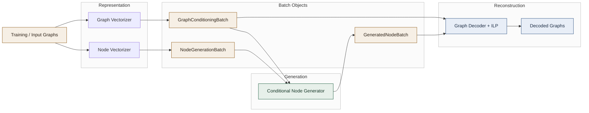
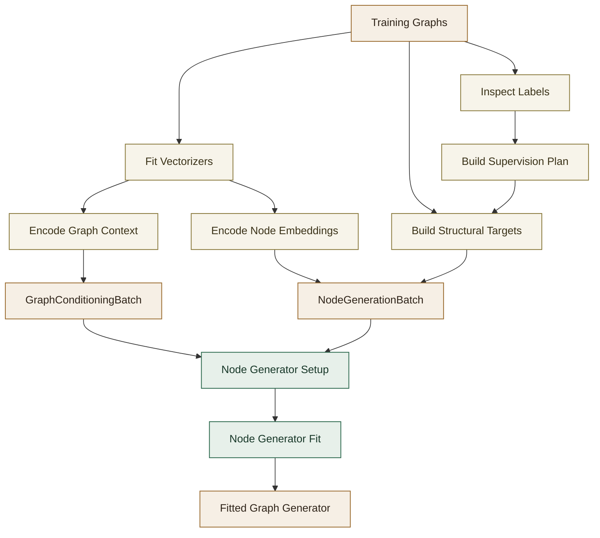
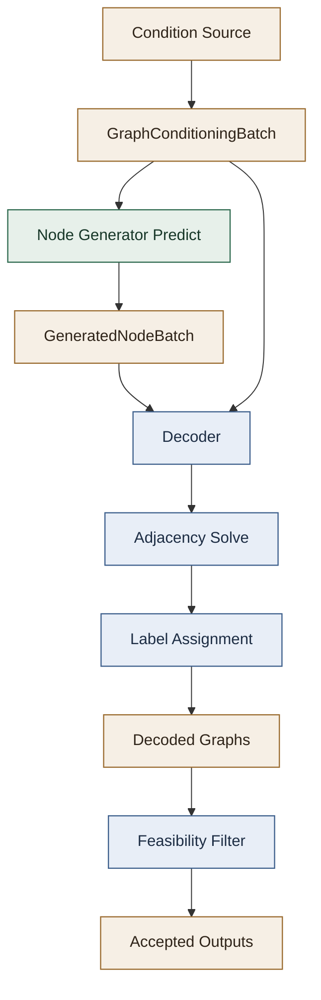

# Graph Generator Architecture

This document explains the architecture of `EquilibriumMatchingDecompositionalGraphGenerator`, the component that turns graphs into training supervision, coordinates the conditional node generator, and reconstructs final `networkx` graphs through the decoder.

Implementation anchors:

- [`../equilibrium_matching_decompositional_graph_generator/graph_engine.py`](../equilibrium_matching_decompositional_graph_generator/graph_engine.py)
- [`../equilibrium_matching_decompositional_graph_generator/node_engine.py`](../equilibrium_matching_decompositional_graph_generator/node_engine.py)
- [`DECODER_README.md`](DECODER_README.md)
- [`EQUILIBRIUM_MATCHING_README.md`](EQUILIBRIUM_MATCHING_README.md)

## Scope

The graph generator is the orchestration layer above the Equilibrium Matching node model.

It is responsible for:

1. fitting graph-level and node-level vectorizers,
2. extracting supervision targets from training graphs,
3. deciding which semantic channels are learned, constant, or disabled,
4. assembling the `NodeGenerationBatch` consumed by the node generator,
5. invoking the conditional node generator at training and inference time,
6. handing generated node-level predictions to the graph decoder,
7. optionally filtering decoded graphs with a feasibility estimator.

It is not itself the neural model and it is not itself the combinatorial decoder. It is the layer that binds those parts into one end-to-end graph pipeline.

## Main Components

At a high level, the architecture has four collaborating parts.

### 1. Graph-Level Vectorizer

`graph_vectorizer` maps a full graph to a fixed-width graph embedding used as part of the conditioning signal.

This embedding represents global graph context and latent semantics. It is combined with explicit graph statistics:

- node count,
- edge count.

Those three pieces form `GraphConditioningBatch`.

### 2. Node-Level Vectorizer

`node_graph_vectorizer` maps each graph to a variable-length matrix of node embeddings.

Those matrices are the training targets for the conditional node generator. During inference, the node generator tries to reconstruct node-level representations that are compatible with the requested conditioning vector.

### 3. Conditional Node Generator

`conditional_node_generator_model` is usually `EquilibriumMatchingDecompositionalNodeGenerator`.

It receives:

- graph-level conditioning,
- padded node-level training examples,
- semantic supervision such as node degrees, node labels, edge existence, and optional auxiliary locality.

It predicts:

- node existence,
- node degrees,
- optional node labels,
- optional edge probabilities,
- optional edge labels.

The internal Equilibrium Matching mechanics are described in [`EQUILIBRIUM_MATCHING_README.md`](EQUILIBRIUM_MATCHING_README.md).

### 4. Graph Decoder

`graph_decoder` converts generated node-level outputs into final graph objects.

Its most important job is structural reconstruction:

- turn soft node existence and degree predictions into a valid node set,
- turn edge probabilities into a binary adjacency matrix,
- enforce structural consistency with a solver,
- attach node and edge labels according to the supervision plan.

The decoder and solver details are documented in [`DECODER_README.md`](DECODER_README.md).

## Data Model

The graph generator works with a few explicit batch abstractions.

### `GraphConditioningBatch`

This holds graph-level conditions:

- `graph_embeddings`
- `node_counts`
- `edge_counts`

This object is used both during training and generation.

`node_counts` is a global size condition, not a per-slot support decision. It tells the generator how large the graph should be, but it does not determine which latent node slots will survive into the final graph.

### `NodeGenerationBatch`

This holds padded node-level supervision for the conditional model:

- `node_embeddings_list`
- `node_presence_mask`
- `node_degree_targets`
- optional `node_label_targets`
- optional direct edge supervision
- optional edge label supervision
- optional auxiliary locality supervision

`node_presence_mask` is not redundant with `node_counts`.

It serves two roles:

- during training, it marks which padded rows correspond to real nodes,
- during generation, it represents the local occupancy pattern that realizes the global node-count target.

This distinction matters because generation is not treated as “the first `k` rows exist by construction”. The model is allowed to explore several candidate node slots and then gradually coalesce onto a final support set.

### `GeneratedNodeBatch`

This is the output of the conditional node generator during inference:

- node presence mask,
- predicted degrees,
- optional predicted node labels,
- optional edge probability matrices,
- optional edge label matrices.

The decoder consumes this object and reconstructs `networkx` graphs.

Conceptually:

- `node_counts` says how many nodes the graph should contain,
- `node_presence_mask` says which specific node slots are currently materialized.

The current architecture keeps both because the generation process is allowed to be gradual and competitive rather than committing to a fixed support immediately.

## Training Architecture

The `fit()` path in `EquilibriumMatchingDecompositionalGraphGenerator` follows a clear sequence.

### Step 1. Fit External Encoders

The generator first fits:

- `graph_vectorizer`
- `node_graph_vectorizer`

If a feasibility estimator is present, it is also fitted here.

This means the graph generator is responsible for learning both the graph-level condition space and the node-level target space before neural training begins.

### Step 2. Inspect Graph Labels

The graph generator extracts:

- per-node label targets via `graphs_to_node_label_targets()`
- per-edge label targets via `graphs_to_edge_label_targets()`

Important current behavior:

- if no node labels exist anywhere, a constant dummy node label is inserted,
- if node labels are mixed between present and missing, `fit()` fails fast,
- if usable edge labels are absent, the edge-label channel is disabled.

This inspection stage prevents the node generator and decoder from training heads that are impossible or pointless for a given dataset.

### Step 3. Build A Supervision Plan

The supervision plan is one of the most important architectural ideas in the codebase.

`_build_supervision_plan()` decides, per channel, whether it is:

- `learned`
- `constant`
- `disabled`

Channels currently include:

- node labels,
- edge labels,
- direct edges,
- auxiliary locality.

Examples:

- if all node labels are the same, node labels become `constant` rather than learned,
- if no usable edge labels are present, edge labels become `disabled`,
- direct edge supervision is enabled by default because the decoder needs structural edge scores,
- auxiliary locality is enabled only when `locality_horizon > 1`.

This plan is then attached to both the node generator and the decoder, so they interpret the same dataset semantics consistently.

### Step 4. Encode Graphs

`encode()` combines:

- `node_encode()` from the node-level vectorizer,
- `graph_encode()` from the graph-level vectorizer.

This creates:

- node embedding targets for training,
- graph conditioning vectors for the conditional model.

### Step 5. Build Structural Supervision

If direct edge supervision is enabled, the decoder is used during training-time preprocessing to compute locality supervision:

- horizon-1 direct edge labels,
- optional higher-horizon auxiliary locality labels.

This is an important design choice: the decoder is not only an inference component. It also defines the edge/locality supervision used to train the node generator.

### Step 6. Assemble `NodeGenerationBatch`

`_build_node_batch()` converts the raw graphs and embeddings into explicit supervision tensors:

- padded node masks,
- integer degree targets,
- optional node labels,
- optional edge supervision channels.

The node generator does not discover these targets implicitly. The graph generator constructs them explicitly.

### Step 7. Train The Node Generator

Finally, the graph generator calls:

1. `conditional_node_generator_model.setup(...)`
2. `conditional_node_generator_model.fit(...)`

This separation lets the node generator:

- fit scalers and vocabularies,
- configure supervision heads,
- then launch Lightning training.

When training completes, the graph generator marks itself as fitted and becomes eligible for `decode()`, `sample()`, `conditional_sample()`, `interpolate()`, and `mean()`.

## Inference Architecture

The inference path reuses the same components but in reverse.

### 1. Produce Conditioning

Generation can start from:

- new sampled graph-level conditions via `sample()`,
- conditioning vectors encoded from existing graphs via `decode()` or `conditional_sample()`,
- interpolated conditions via `interpolate()`,
- a mean latent condition via `mean()`.

The conditioning always stays in the `GraphConditioningBatch` format.

### 2. Predict Node-Level Structure And Semantics

`_decode_conditioning_batch()` calls the conditional node generator’s `predict(...)`.

This produces `GeneratedNodeBatch`, which may contain:

- node presence predictions,
- degree predictions,
- node labels,
- edge probabilities,
- edge labels.

The exact set depends on the supervision plan and the fitted model heads.

The intended interpretation is that node existence is an occupancy process, not just a padding artifact. During generation, the model can temporarily distribute probability mass across several candidate node slots. As the relaxation proceeds, those candidates can compete and collapse to a final materialized node set that is consistent with the requested graph size and the rest of the predicted structure.

### 3. Decode Graphs

The graph decoder reconstructs graph objects from `GeneratedNodeBatch`.

This stage:

- decides which nodes exist,
- solves for graph structure,
- assigns labels according to learned/constant/disabled channel modes.

The graph generator itself does not build edges directly. It delegates that responsibility to the decoder.

### 4. Optional Feasibility Filtering

If a feasibility estimator is configured, `_decode_with_feasibility_slots()` can:

- generate multiple candidates per requested graph,
- score them as feasible or infeasible,
- fill output slots only with accepted graphs,
- retry missing slots for several rounds.

This adds a second layer of quality control after decoding.

Architecturally, this is separate from the ILP decode:

- the decoder enforces local structural constraints,
- the feasibility estimator acts as a post-hoc accept/reject model for domain-specific validity.

## Control Flow By Public API

### `fit(graphs, train_node_generator=True, targets=None)`

Full training orchestration:

1. fit vectorizers,
2. inspect labels,
3. build supervision plan,
4. encode graphs,
5. build supervision tensors,
6. train the node generator.

### `decode(graph_conditioning, ...)`

Decode a supplied `GraphConditioningBatch` directly into graphs.

Use this when conditioning vectors are already available.

### `sample(n_samples, ...)`

Sample graph-level conditions from cached training conditioning, then decode them.

By default, this samples stored graph-conditioning rows directly. When `interpolate_between_n_samples` is provided, each requested output first draws a small subset of cached training conditioning rows, scores candidate pairs by cosine similarity on the cached graph-vectorizer embeddings, samples a pair, and linearly interpolates graph embedding, node count, and edge count to form a new conditioning vector.

### `conditional_sample(graphs, n_samples, ...)`

Encode each input graph, repeat each condition `n_samples` times, then decode multiple generated variants per input graph.

### `interpolate(G1, G2, k, interpolation_mode)`

Encode two graphs, interpolate in graph-conditioning space, interpolate node/edge counts separately, then decode each intermediate point.

### `mean(graphs)`

Compute a conditioning barycentre from several graphs and decode a single representative graph.

## Architectural Strengths

The current design has a few strong properties.

### Explicit Separation Between Representation And Reconstruction

The node generator learns a continuous conditional representation problem.

The decoder handles discrete structural consistency afterward.

This is cleaner than forcing the neural model to output a valid graph directly.

### Dataset-Adaptive Supervision

The supervision plan prevents unnecessary heads from being trained.

That keeps behavior sensible for datasets with:

- no node labels,
- constant node labels,
- no usable edge labels,
- optional auxiliary locality.

### Reusable Conditioning Space

The graph-level conditioning abstraction supports:

- direct reconstruction,
- random generation,
- interpolation,
- mean-graph synthesis,
- conditional guidance.

The same decode machinery is reused across all of them.

### Explicit Failure Modes

The graph generator now fails fast when:

- it is used before `fit()`,
- node labels are inconsistently present,
- feasibility filtering cannot fill outputs and failure mode is `raise`,
- the decoder reports solver failure.

That is operationally much safer than silent partial failure.

## Architectural Risks And Limitations

The main tradeoffs are also clear.

### Tight Coupling Between Orchestrator And Training Semantics

`EquilibriumMatchingDecompositionalGraphGenerator` still knows a lot about:

- label semantics,
- locality supervision policy,
- decoder-assisted supervision,
- feasibility filtering,
- how the node generator should be configured.

That makes it powerful, but also means it is not yet a thin orchestration layer.

### Structural Quality Depends On Two Models

Good graph reconstruction depends on both:

- the node generator producing good edge and degree signals,
- the decoder successfully reconciling them.

If either side is weak, output quality suffers.

### Scaling Pressure In The Decoder

The graph generator architecture assumes decode-time optimization is acceptable for the graph sizes of interest.

For larger graphs, the solver can become the bottleneck even if the neural generator is fast.

### Vectorizer Quality Is Critical

The system inherits the inductive biases of:

- `graph_vectorizer`
- `node_graph_vectorizer`

If those embeddings are weak or unstable, the downstream Equilibrium Matching model and decoder cannot fully compensate.

## Extension Points

The current architecture is designed to allow targeted replacement of major pieces.

### Swap The Graph-Level Vectorizer

You can replace `graph_vectorizer` as long as it exposes a compatible `fit()` / `transform()` interface and produces fixed-width graph embeddings.

### Swap The Node-Level Vectorizer

You can replace `node_graph_vectorizer` as long as it produces per-graph node embedding matrices in a stable node order.

### Swap The Conditional Node Generator

Any model implementing the `ConditionalNodeGeneratorBase` interface can replace the Equilibrium Matching model if it supports:

- `setup(...)`
- `fit(...)`
- `predict(...)`

### Swap The Decoder

The graph decoder can be replaced independently if it can consume `GeneratedNodeBatch`-style outputs and reconstruct graphs with the same supervision-plan semantics.

### Add Domain-Specific Validity Checks

A feasibility estimator can be attached without changing the neural model or the decoder formulation.

This is useful when “valid” means more than just satisfying degree/connectivity constraints.

## Recommended Reading Order

For someone new to the codebase, the fastest way to build accurate context is:

1. [`../README.md`](../README.md)
2. this file
3. [`EQUILIBRIUM_MATCHING_README.md`](EQUILIBRIUM_MATCHING_README.md)
4. [`DECODER_README.md`](DECODER_README.md)
5. [`../equilibrium_matching_decompositional_graph_generator/graph_engine.py`](../equilibrium_matching_decompositional_graph_generator/graph_engine.py)
6. [`../equilibrium_matching_decompositional_graph_generator/node_engine.py`](../equilibrium_matching_decompositional_graph_generator/node_engine.py)
