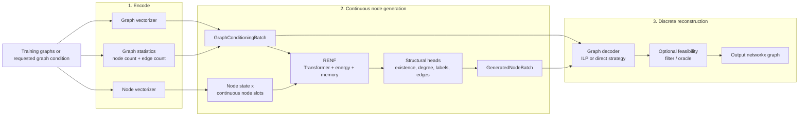
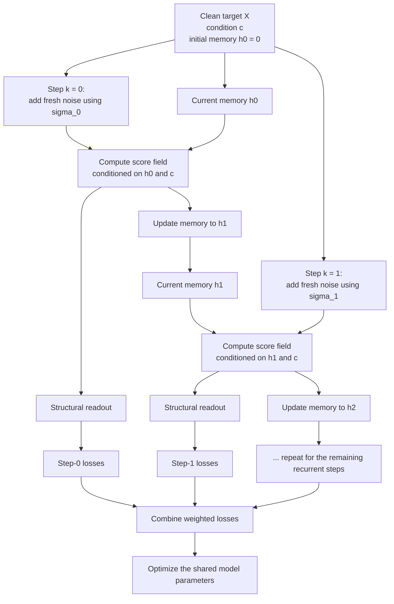

# Recurrent Energy NodeField (RENF)

This document explains the recurrent-energy extension from the ground up. It is written as a standalone guide: you do not need to know the NodeField codebase, energy-based models, or graph neural networks before reading it.

The short version is:

> RENF generates a graph in two stages. First, it repeatedly refines a table of continuous node representations while carrying a separate memory for every possible node slot. Then the graph decoder turns those soft node-level predictions into one discrete `networkx` graph.

RENF is an optional mode of the existing Conditional Node Field generator. It does not replace the complete graph-generation pipeline; it changes the continuous node-refinement engine inside that pipeline.

Implementation entry points:

- [`conditional_node_field_generator.py`](../conditional_node_field_graph_generator/conditional_node_field_generator.py) contains the public node-generator façade and the underlying Lightning module.
- [`recurrent_node_field.py`](../conditional_node_field_graph_generator/recurrent_node_field.py) contains the recurrent state, recurrent training rollout, and recurrent sampler.
- [`recurrent_interventions.py`](../conditional_node_field_graph_generator/recurrent_interventions.py) contains deterministic reset, shuffle, and replacement experiments.
- [`recurrent_diagnostics.py`](../conditional_node_field_graph_generator/recurrent_diagnostics.py) contains trajectory storage and stability diagnostics.
- [`conditional_node_field_graph_generator.py`](../conditional_node_field_graph_generator/conditional_node_field_graph_generator.py) coordinates graph encoding, node generation, graph decoding, and optional feasibility filtering.
- [`3_CONDITIONAL_NODE_FIELD_GRAPH_DECODER_README.md`](3_CONDITIONAL_NODE_FIELD_GRAPH_DECODER_README.md) explains the final adjacency reconstruction in detail.

## 1. What problem is the system solving?

The input to the system is a collection of graphs, such as molecular graphs or synthetic cycle/path/star graphs. A graph contains discrete objects:

- nodes,
- edges between nodes,
- optional node labels,
- optional edge labels.

The model is not asked to predict a whole adjacency matrix directly. Instead, the task is deliberately decomposed:

1. Turn a graph into numerical representations.
2. Use a graph-level condition to generate a fixed-size set of candidate node representations.
3. Predict which candidate slots exist, their degrees, and optional labels and edge relationships.
4. Reconstruct a discrete graph from those predictions while enforcing global structural constraints.

The decomposition matters because continuous neural refinement and discrete graph construction have different jobs. RENF is responsible for the first continuous part. The graph decoder is responsible for the second discrete part.

## 2. The complete pipeline

The following diagram shows the full system. RENF is the green middle box; the other boxes are still needed to go from graphs to graphs.



At training time, the node and graph vectorizers are fitted from reference graphs. At generation time, the graph condition is either supplied by the user or sampled/interpolated from cached training conditions. In both cases, the node generator produces soft outputs first; the decoder creates the final discrete graph afterward.

### 2.1 The main objects passed between components

The names below are the most useful way to understand the interfaces:

| Object | Produced by | Consumed by | Meaning |
| --- | --- | --- | --- |
| `GraphConditioningBatch` | Graph vectorizer and graph statistics | Node generator and decoder | One row of global information per graph: graph embedding, requested node count, requested edge count, and optional node-level condition tokens. |
| `NodeGenerationBatch` | Node vectorizer, graph inspection, and supervision builder | Training code | Reference node embeddings, padding mask, node degrees, optional labels, and optional pairwise edge/locality targets. |
| `ConditionalNodeFieldModule` | Model setup | Training and sampling | The PyTorch module that evaluates the energy field, updates recurrent memory, and applies structural heads. |
| `GeneratedNodeBatch` | Node generator | Graph decoder | Final continuous node embeddings plus predicted existence, degrees, labels, edge probabilities, and edge labels. |
| `RecurrentNodeFieldTrajectory` | Optional sampler capture | Diagnostics and experiments | Detached copies of states, field evaluations, readouts, interventions, and diagnostic values. |
| `networkx.Graph` | Graph decoder | User or downstream evaluation | The final discrete graph. |

The most important boundary is between `GeneratedNodeBatch` and the graph decoder. A neural output is probabilistic and may violate graph constraints. The decoder is the component that decides which nodes and edges actually appear in the returned graph.

## 3. What each component does

### 3.1 Graph-level vectorizer: describes the requested graph globally

The graph vectorizer maps an entire graph to a fixed-width embedding. It captures global information that is awkward to reconstruct from individual node rows, such as overall graph context or semantics.

The graph condition also carries explicit graph statistics, notably:

- the requested number of nodes,
- the requested number of edges.

These counts are not merely descriptive metadata. They are available to the model as conditioning signals and are also used later by the decoder when resolving the active node support and selecting an adjacency.

The condition can be represented as either:

- one vector per graph, shape `(B, C)`, or
- several condition tokens per graph, shape `(B, M, C)`.

Here $B$ is the batch size, $M$ is the number of condition tokens, and $C$ is the condition width. The Transformer cross-attends to these condition tokens.

### 3.2 Node-level vectorizer: provides the continuous training target

The node vectorizer maps each graph to a matrix with one row per graph node. Each row is a continuous representation of one node. Graphs usually have different numbers of nodes, so the matrices are padded to a common maximum number of node slots for batching.

The row order is a strict contract. The following all use the same graph-local node order:

- node-vectorizer rows,
- graph node iteration order,
- padding mask,
- degree targets,
- node labels,
- edge-pair indices,
- final graph assembly.

Breaking this alignment can produce plausible-looking but incorrect graphs, because predictions would be attached to the wrong nodes.

### 3.3 `ConditionalNodeFieldGenerator`: the user-facing node model

`ConditionalNodeFieldGenerator` is the scikit-learn-friendly façade. It owns preprocessing, scaling, setup, fitting, prediction, checkpoint restoration, and conversion between NumPy-facing objects and the PyTorch module.

Typical responsibilities are:

- fit or use the node and graph embedding transforms,
- scale continuous inputs and conditions,
- create the underlying `ConditionalNodeFieldModule`,
- run the training coordinator,
- call the sampler at inference time,
- inverse-transform generated node embeddings,
- build a `GeneratedNodeBatch`.

Use this façade when calling the model from application code. The lower-level module is useful for focused tests and research experiments.

### 3.4 `ConditionalNodeFieldModule`: the neural computation

In the tensor shapes below, $B$ is the number of graphs processed together, $N$ is the maximum number of node slots per graph, $D$ is the continuous input feature width, $C$ is the graph-condition width, $M$ is the number of condition tokens, and $H$ is the recurrent hidden-state width.

The module receives three kinds of tensors:

- $x$: the current continuous node state, shape `(B, N, D)`;
- $c$: graph-level conditioning, shape `(B, C)` or `(B, M, C)`;
- `node_mask`: a boolean shape `(B, N)` identifying real node slots rather than padding.

$N$ is the configured maximum number of node rows, not necessarily the number of nodes that will exist in the final graph. $D$ is the input feature width. $B$, $C$, and $M$ describe the batch and conditioning layouts just introduced.

In recurrent mode it also receives:

- $h$: per-node recurrent memory, shape `(B, N, H)`.

The memory is initialized to zeros and is carried from one field evaluation to the next during a rollout. A boolean value in `node_mask` is `True` for a real node slot and `False` for padding; padded slots are ignored and kept at zero.

### 3.5 The shared Transformer: lets node slots communicate and see the condition

The shared Transformer is used at every recurrent step. It performs:

1. self-attention among node slots, so one node can respond to the current state of other nodes;
2. cross-attention from node slots to the graph condition, so the node state is graph-conditional;
3. a feed-forward transformation.

The recurrent input path first encodes $x$ and projects $h$ into the latent width. Those two representations are fused before entering the Transformer.

The Transformer weights are shared across all rollout depths. There is not one separate Transformer copy for step 1, another for step 2, and so on. This is why changing the number of inference steps changes computation and behavior, but does not increase the parameter count.

Padding is masked throughout the attention and output paths. Padded node states and padded hidden states are forced back to zero.

### 3.6 The potential head: the scalar energy-like quantity

After the Transformer produces one latent token per node, `potential_head` maps each token to one scalar value:

Here $i$ is the index of a node slot, $z_i$ is the Transformer latent token for slot $i$, $p_\theta$ denotes the learned scalar potential head, and $\theta$ denotes all learned model parameters. The per-slot scalar is $\phi_i$; the graph-level scalar potential $\phi$ is the sum of those per-slot scalars over all node slots.

$$
\phi_i(x, h, c) = p_\theta(z_i), \qquad \phi(x, h, c) = \sum_{i=1}^{N} \phi_i(x, h, c).
$$

The model does not use the scalar potential as its final prediction. It uses its gradient with respect to the continuous node state to obtain a score field:

The symbol $s$ denotes the score field: a tensor with the same shape as $x$ that tells the sampler how to change the continuous node state. In this partial derivative, $h$ and $c$ are held fixed while $x$ changes.

$$
s(x, h, c) = -\frac{\partial \phi(x, h, c)}{\partial x}.
$$

The negative sign makes the score point in the direction used to refine the state. Because the score is derived from a scalar, it is an energy-based field, not an independently predicted vector residual.

When the score is computed, $h$ is held fixed for this partial derivative. The implementation creates a distinct $x$ branch for differentiation so that the gradient is with respect to $x$, while outer training gradients can still flow through the recurrent computation and its history.

### 3.7 The recurrent memory: carries information between evaluations

The recurrent extension adds a separate hidden vector to every node slot. It is updated from the current Transformer latent tokens:

At recurrent evaluation $k$, $h_k$ is the current hidden state, $z_k$ is the set of Transformer latent tokens produced at that evaluation, and $h_{k+1}$ is the next hidden state. The integer $k$ starts at zero and counts recurrent field evaluations. $\alpha$ is the scalar `recurrent_update_scale`, $u_\theta$ is the learned recurrent state-update function, and $\mathrm{Norm}$ is either the configured hidden-state normalization layer or the identity function when normalization is disabled.

$$
h_{k+1} = \mathrm{Norm}\left( h_k + \alpha\,u_\theta(z_k) \right),
$$

Here $\alpha$ is `recurrent_update_scale`. The normalization is optional and is enabled by default.

The memory has three important properties:

- It is per node slot, so the model can retain node-specific information.
- It persists across field evaluations, allowing later steps to use a summary of earlier states.
- Its parameters are shared across all steps.

The memory is not the same thing as $x$. $x$ is the continuously updated node representation that is eventually returned. $h$ is internal recurrent context that influences later evaluations and is returned only as part of the optional trajectory or last-state diagnostics.

### 3.8 Structural heads: turn latent tokens into graph-relevant predictions

The potential/score path refines continuous node representations. Structural heads interpret the final latent tokens:

| Head | Prediction | Why it exists |
| --- | --- | --- |
| Existence head | One logit per slot | Estimates whether the slot should become a real node. |
| Degree head | A categorical distribution over degrees `0..max_degree` | Supplies a predicted degree for each active node. |
| Node-label head | Optional categorical distribution | Predicts node labels when the training data has usable labels. |
| Direct edge head | Optional pairwise probability for each node pair | Predicts whether two node slots should be connected. |
| Edge-label head | Optional categorical distribution per node pair | Predicts labels for edges when edge labels are available. |
| Auxiliary locality head | Optional pairwise probability for a configured higher-hop relation | Provides a structural regularizer and optional higher-horizon decoder signal. |

Heads can be learned, constant, or disabled according to the supervision plan. For example, an unlabeled dataset does not require a learned label head. A dataset without direct edge supervision can still use node and degree heads.

The final node feature tensor does not directly contain categorical node labels. Labels are kept as separate predictions and are attached by the graph decoder.

## 4. What “recurrent energy” changes

There are two modes:

### Baseline mode

```python
ConditionalNodeFieldGenerator(node_field_mode="baseline")
```

Baseline mode retains the original stationary energy field, loss, parameter initialization, and sampler. It has no recurrent memory modules. Old saved generators that do not contain a mode are treated as baseline models.

### Recurrent-energy mode

```python
ConditionalNodeFieldGenerator(
    node_field_mode="recurrent_energy",
    recurrent_training_steps=8,
    recurrent_detach_interval=4,
)
```

Recurrent mode adds shared per-node memory around the same basic energy-field idea. At each step, the model:

1. combines the current $x$ and current $h$;
2. runs the shared conditional Transformer;
3. evaluates the scalar potential and its score with respect to $x$;
4. updates $h$ from the current latent tokens;
5. updates $x$ during sampling, or proceeds to the next supervised training step.

The recurrent mode does not create a new set of parameters for every step. `recurrent_hidden_dimension=None` means that $H$ follows the latent dimension.

## 5. Training: what happens in one example

Assume a clean node matrix $X$ with shape `(B, N, D)`, a graph condition $c$, and a node mask. $X$ is the reference continuous node representation before training corruption is added. The training rollout starts with the zero hidden state $h_0$, where the subscript `0` means “before the first recurrent evaluation”:

$$
h_0 = 0.
$$

For each of $K$ steps, where $K$ is the positive integer configured by `recurrent_training_steps`, the model performs the following operations.

### Step 1: create a corrupted input

Draw fresh standard Gaussian noise $\epsilon_k$ for step $k$, and choose a positive corruption scale $\sigma_k$ for that step from the configured schedule. The variable $\tilde{x}_k$ below denotes the resulting noisy version of the clean state $X$:

$$
\tilde{x}_k = X + \sigma_k\,\epsilon_k.
$$

Here $\epsilon_k$ has the same shape as $X$, $\sigma_k$ controls the amount of corruption, and $\tilde{x}_k$ is the input used for the score evaluation at step $k$.

The schedule is:

- `annealed`: starts at `recurrent_sigma_max` and decreases geometrically to `recurrent_sigma_min`;
- `constant`: uses `recurrent_sigma_max` at every step;
- `none`: uses clean inputs and explicitly disables the score loss.

The schedule is a training device. Sigma and the step index are not provided as network inputs, so the learned field remains stationary with respect to those values.

### Step 2: evaluate the score while holding memory fixed

The model computes the step-$k$ score $s_k$, meaning the score field evaluated at the noisy state $\tilde{x}_k$ with the current memory $h_k$ and condition $c$:

$$
s_k = -\frac{\partial \phi(\tilde{x}_k, h_k, c)} {\partial \tilde{x}_k}.
$$

Only the input branch is differentiated for this partial derivative. The current hidden state is treated as fixed for the field evaluation because $h_k$ is the context that was already available when step $k$ began: it summarizes earlier evaluations, while $x$ is the state that the current score is supposed to refine. In other words, the question answered by this derivative is “given the current memory and condition, which direction should this node state move?” That is a local field evaluation conditioned on $h_k$, not a request to differentiate through the memory-update rule as well.

If the derivative also followed the hidden-state path, it would become a total derivative through the recurrent history. The resulting vector could then mix two different effects: the direction that changes the current node state and the direction that changes the memory representation. That would make the score depend on how the rollout arrived at the current step, rather than representing the local energy gradient at the current $(\tilde{x}_k, h_k, c)$. The memory is updated separately after this score has been computed, producing $h_{k+1}$. Holding $h_k$ fixed for the partial derivative therefore keeps the roles distinct: $s_k$ refines $\tilde{x}_k$, and the recurrent update prepares context for the next evaluation. This does not prevent the model from learning through recurrent history: when training uses `create_graph=True`, outer optimization gradients can still pass through the sequence of computations and the hidden-state updates.

### Step 3: train the score with denoising score matching

For Gaussian corruption, the target score $s_k^\star$ is the score that the model should reproduce at step $k$:

$$
s_k^\star = -\frac{\epsilon_k}{\sigma_k}.
$$

The score loss compares the predicted score with this target on real node features. Padded rows do not contribute. Optional sparse supervision can reduce the number of feature coordinates used for this objective.

When the schedule is `none`, the score loss is exactly zero; the implementation does not divide by zero or pretend that a score target exists.

### Step 4: make a denoised structural readout

The structural heads are evaluated on a denoised state. The symbol $x_k^{\mathrm{denoised}}$ names this corrected estimate of the clean node state at step $k$:

$$
x_k^{\mathrm{denoised}} = \tilde{x}_k + \sigma_k^2 s_k.
$$

That state is encoded again with the current $h_k$, and the node/edge heads produce structural losses. This second encoding is a readout only: it does not advance the recurrent memory a second time.

The structural objectives may include:

- node existence,
- node degree,
- node labels,
- direct edge existence,
- edge labels,
- expected node count,
- expected edge count,
- degree/edge-count consistency,
- auxiliary higher-hop locality.

Every enabled structural objective is evaluated at each supervised recurrent step. The resulting losses are combined with normalized step weights. If `recurrent_supervise_all_steps=False`, only the final step contributes a supervised loss, but the preceding recurrent computations still occur because they build the hidden state used by the final step.

### Step 5: update memory and optionally truncate backpropagation

The hidden state is updated from the latent tokens produced at the noisy field evaluation. In the notation below, $f_\theta$ is the learned recurrent update function, $h_k$ is the current memory, $z_k$ is the current set of latent node tokens, and $h_{k+1}$ is the memory passed to the next evaluation:

$$
h_{k+1} = f_\theta(h_k, z_k).
$$

The function $f_\theta$ is the full recurrent update represented in the earlier equation: it combines the existing memory with the learned update from the current latent tokens and then applies the configured normalization.

If `recurrent_detach_interval=4`, the graph used by automatic differentiation is cut after every four updates. Memory values continue numerically, but the gradient no longer travels through earlier chunks. Set the interval to `None` for full backpropagation through the entire rollout; this uses more memory and can be harder to optimize.

### Training flow in one picture



## 6. Sampling: how a graph is generated

At inference time there is no clean target $X$. The sampler starts with a standard-normal continuous node state $x_0$ and zero memory $h_0$. Here $x_0$ has shape `(B, N, D)`, $h_0$ has shape `(B, N, H)`, $\mathcal{N}(0, I)$ means a standard normal distribution, and $I$ is the identity covariance matrix:

$$
x_0 \sim \mathcal{N}(0, I), \qquad h_0 = 0.
$$

For each of $T$ sampling steps, where $T$ is the requested positive number of field evaluations, it:

1. applies any configured intervention before field evaluation;
2. evaluates the conditional score using $(x_k, h_k, c)$;
3. optionally combines conditional and unconditional scores for classifier-free guidance;
4. updates the continuous state;
5. updates the recurrent memory.

The default deterministic update is:

Here $x_k$ is the current continuous node state, $x_{k+1}$ is the state after one update, $s(x_k, h_k, c)$ is the score evaluated at the current state and memory, and $\eta$ is the positive step size configured by `sampling_step_size`:

$$
x_{k+1} = x_k + \eta s(x_k, h_k, c),
$$

If `langevin_noise_scale > 0`, Gaussian noise is added after this update. This Langevin noise is separate from training corruption and separate from intervention replacement noise.

There is no sampling corruption schedule. Consequently, trajectory entries use `sigma=0.0` during sampling. A training sigma schedule must not be interpreted as a time input to the sampler.

After the final update, a readout evaluates the structural heads without advancing memory. The façade then:

1. converts the continuous state back to the original feature scale;
2. converts existence logits to probabilities and a presence mask;
3. converts degree logits to predicted degree classes;
4. converts optional label and edge heads to their output forms;
5. packages everything as `GeneratedNodeBatch`.

The raw module output and the façade output are intentionally different:

```python
# Low-level module: continuous node state
x = module.generate_recurrent(condition, total_steps=32)

# Façade: node-level predictions and metadata
generated = node_generator.predict_recurrent(condition, total_steps=32)
```

`generate_recurrent()` returns a tensor unless trajectory capture is requested. `predict_recurrent()` returns a `GeneratedNodeBatch`, and returns `(GeneratedNodeBatch, trajectory)` when `return_trajectory=True`.

## 7. From `GeneratedNodeBatch` to a final graph

The graph decoder performs the discrete reconstruction. It is not just a formatting function and it is not another neural network. Its job is to make a globally coherent graph from soft, potentially conflicting predictions.

The decoder uses:

- node existence probabilities or masks to determine the active node support;
- degree predictions as structural targets;
- direct edge probabilities as the primary edge preference;
- optional higher-horizon locality probabilities as path constraints;
- node and edge label predictions after the adjacency is fixed;
- requested node and edge counts from `GraphConditioningBatch`.

With the default ILP strategy, the decoder solves for a binary adjacency matrix subject to configured degree, edge-count, connectivity, and optional horizon constraints. The direct strategy is a lighter alternative that selects edges from the probabilities and reconciles them with the requested structure.

If a feasibility estimator is enabled, it can participate in two separate places:

1. **Oracle-guided structural reconstruction:** inspect a candidate adjacency, add no-good cuts for persistent violating edge sets, and re-solve.
2. **Post-decode filtering:** reject infeasible graphs and retry missing output slots for a bounded number of attempts.

These are different responsibilities. A graph can be structurally solvable by the decoder and still fail a domain-specific feasibility test.

The end-to-end graph-level call is therefore conceptually:

```text
graph condition
    -> recurrent node sampler
    -> GeneratedNodeBatch
    -> structural decoder
    -> optional feasibility/oracle loop
    -> networkx.Graph
```

The graph-level façade exposes this through methods such as `sample(...)`, `decode(...)`, and the guidance-specific sampling methods on `ConditionalNodeFieldGraphGenerator`.

## 8. Guidance: different mechanisms with different roles

RENF can be used with several kinds of conditioning or guidance. They should not be conflated.

### Ordinary graph conditioning

The graph embedding and explicit graph statistics are always part of the normal condition. They tell the model what kind of graph and what global size it is trying to generate.

### Classifier-free guidance (CFG)

When target conditioning is configured, training sometimes drops the target portion of the condition. At sampling time the model evaluates both a conditional score $s_{\mathrm{cond}}$ and an unconditional/null-target score $s_{\mathrm{uncond}}$. The symbol $s_{\mathrm{guided}}$ is the combined score, and $w$ is the nonnegative CFG guidance scale configured by `guidance_scale`:

- a conditional branch,
- an unconditional/null-target branch.

The scores are combined as:

$$
s_{\text{guided}} = s_{\text{uncond}} + w\left(s_{\text{cond}} - s_{\text{uncond}}\right).
$$

In recurrent mode the two branches have independent persistent hidden memories. They receive matched intervention randomness, so an intervention does not create an accidental difference in random-number consumption between branches.

### Separate classifier or regression guidance

The façade can also use a separately trained classifier or regressor. Its gradient is added during sampling through a callback. This is a separate path from CFG; the implementation does not allow both guidance mechanisms to be combined in the same call.

## 9. Interventions and what they mean

Interventions are controlled experiments on the recurrent process. They are applied **before** the field evaluation at a specified zero-based step.

Therefore `step=4` changes the input to the fifth field evaluation.

```python
from conditional_node_field_graph_generator import RecurrentIntervention

intervention = RecurrentIntervention(
    "reset_hidden",
    step=4,
)
```

Supported intervention kinds:

| Kind | Effect |
| --- | --- |
| `reset_hidden` | Replaces all recurrent memory with zeros. |
| `shuffle_hidden_nodes` | Permutes hidden states among valid nodes within each graph. |
| `fresh_x_noise` | Replaces $x$ with fresh Gaussian noise at one step. |
| `fresh_x_noise_every_step` | Replaces $x$ with fresh Gaussian noise at every step. |
| `none` | Leaves the rollout unchanged. |

Important details:

- `every_step=True` repeats a hidden reset or shuffle.
- `fresh_x_noise_every_step` is inherently repeated.
- `noise_scale` is measured in scaled feature coordinates.
- Intervention RNGs are local and seeded independently from the sampler RNG.
- Enabling an intervention therefore does not change unrelated sampling RNG consumption.
- Hidden shuffles stay within each graph and touch only valid node slots when a mask is supplied.
- Padding remains zero.
- A list of interventions can reset both $x$ and $h$ at the same evaluation.

Interventions are useful for answering questions such as:

- Does the result depend on persistent memory?
- Does node identity matter, or can memory be shuffled?
- Does a mid-rollout state replacement cause recovery?
- Does the process remain stable when new feature noise is injected?

They are diagnostic probes, not additional training mechanisms.

## 10. Trajectories and diagnostics

Trajectory capture is off by default because it copies tensors and performs extra readouts. Enable it only when the intermediate process is needed:

```python
generated, trajectory = node_generator.predict_recurrent(
    graph_conditioning,
    total_steps=32,
    return_trajectory=True,
)
```

The trajectory stores detached CPU tensors, so it does not retain the training autograd graph. Its lists have intentionally different meanings:

| Field | Contents for $T$ steps |
| --- | --- |
| $x$, $h$ | Initial state plus each completed update: `T + 1` entries. |
| `evaluated_x`, `evaluated_h` | The actual field inputs before each update: $T$ entries. |
| `score`, `phi`, `sigma` | Field outputs and sampling sigma for each evaluation: $T$ entries. |
| `readouts` | Structural readouts after each completed update: $T$ entries. |
| `interventions` | Records of interventions that were active at a step. |
| `diagnostics` | State and prediction-change measurements for each step. |
| `metadata` | Counts of field evaluations, readouts, timing, and sampler settings. |

This distinction is important. If $x$ is replaced by an intervention, the replacement is not the sampler's ordinary update. Comparing `evaluated_x` with $x$ lets an experiment distinguish an intervention jump from the model's own update.

The diagnostics include:

- RMS hidden-state norm,
- RMS hidden-state update,
- RMS score norm,
- RMS $x$ update,
- consecutive hidden-state cosine,
- consecutive-score cosine,
- changes in existence, degree, label, and edge predictions.

Missing first-step comparisons are represented as `None`. Small state or prediction changes indicate empirical stabilization only. They are not a proof that the sampler has converged or reached a mathematically stationary point.

## 11. Configuration reference

The recurrent options are passed to both the façade and the underlying module. The defaults are designed to preserve a modest rollout while keeping the mode explicit.

| Option | Meaning | Default / allowed values |
| --- | --- | --- |
| `node_field_mode` | Selects the original or recurrent implementation. | `baseline` or `recurrent_energy`; façade default is `baseline`. |
| `recurrent_hidden_dimension` | Width $H$ of each per-slot hidden vector. | `None` means latent width. |
| `recurrent_training_steps` | Number of recurrent evaluations used for each training example. | `8` |
| `recurrent_detach_interval` | Truncates gradient history after this many updates. | `4`; `None` means full rollout backpropagation. |
| `recurrent_update_scale` | Multiplier on the hidden-state update. | `1.0`; finite numeric value. |
| `recurrent_initial_state` | Memory initialization policy. | Only `zeros` is supported. |
| `recurrent_state_normalization` | Applies `LayerNorm` after the hidden update. | `True` |
| `recurrent_corruption_schedule` | Training corruption policy. | `annealed`, `constant`, or `none`. |
| `recurrent_sigma_min` | Final annealed training corruption scale. | `0.02`; positive. |
| `recurrent_sigma_max` | Initial annealed or constant training corruption scale. | Defaults to `node_field_sigma`; positive. |
| `recurrent_supervise_all_steps` | Whether all recurrent steps contribute structural supervision. | `True` |
| `recurrent_loss_discount` | Relative weighting across supervised steps. | `1.0`; must be positive. |
| `sampling_steps` / `total_steps` | Number of field evaluations at inference. | `sampling_steps` by default, overridable per call. |
| `sampling_step_size` | Size $\eta$ of each continuous state update. | Existing NodeField option. |
| `langevin_noise_scale` | Optional noise added after each sampling update. | Existing NodeField option, default `0.0`. |

There are two different notions of “steps”:

- `recurrent_training_steps` controls the rollout used to train one example;
- `sampling_steps` or `total_steps` controls the rollout used to generate one sample.

They do not have to be equal. Inference depth can be changed without creating more parameters.

## 12. Minimal usage examples

### Use RENF through the node-generator façade

```python
from conditional_node_field_graph_generator import ConditionalNodeFieldGenerator

node_generator = ConditionalNodeFieldGenerator(
    node_field_mode="recurrent_energy",
    recurrent_training_steps=8,
    recurrent_detach_interval=4,
    recurrent_corruption_schedule="annealed",
)

# Fit through the existing graph-generator or node-generator workflow.
# After fitting, graph_conditioning is a GraphConditioningBatch.
generated = node_generator.predict_recurrent(
    graph_conditioning,
    total_steps=32,
)
```

### Capture a trajectory and inject a reset

```python
from conditional_node_field_graph_generator import RecurrentIntervention

generated, trajectory = node_generator.predict_recurrent(
    graph_conditioning,
    total_steps=32,
    intervention=RecurrentIntervention("reset_hidden", step=16),
    return_trajectory=True,
)
```

### Use the complete graph generator

The graph-level class still owns graph encoding and decoding. In a complete setup, it contains a recurrent `ConditionalNodeFieldGenerator` as its node generator and a `ConditionalNodeFieldGraphDecoder` as its reconstruction stage. The final call to `sample(...)` returns decoded graphs, not raw node tensors.

## 13. Notebook and experiment defaults

The recurrent notebooks expose the recurrent settings in an editable `NODE_FIELD_CONFIG` dictionary near the model-builder call. Those notebooks explicitly opt into `node_field_mode="recurrent_energy"`; the general `build_graph_generator()` default remains `baseline` for compatibility with existing scripts.

The nine notebooks that construct models expose the full recurrent option set. The artificial-graph and ZINC hyperparameter-search YAML files also declare the recurrent values under their fixed model settings. `None` for the hidden width means “use the latent width,” and `None` for maximum corruption means “use `node_field_sigma`.” Notebook model names include the selected mode. Sampling a previously saved generator uses that generator's stored architecture, so a caller cannot accidentally reinterpret a baseline checkpoint as a recurrent one. The target-similarity workflow starts without automatically selecting a checkpoint, and the ablation notebook keeps an explicit baseline-versus- recurrent comparison matrix.

The recurrent experiment configurations are in [`configs/recurrent_nodefield/`](../configs/recurrent_nodefield/):

- `baseline.yaml` is the control;
- `recurrent_energy_constant.yaml` uses constant training corruption;
- `recurrent_energy_annealed.yaml` uses geometrically decreasing corruption.

The ablation notebook and experiment driver compare these model families over sampling depths and controlled interventions. The experiment driver is:

```bash
python -m conditional_node_field_graph_generator.extensions.demo.recurrent_experiments
```

The default is a smoke experiment: 100 synthetic cycle/path/star graphs, cached 80/10/10 splits, seed 0, ten epochs, and depths 1–32. Full mode uses 1,000 graphs and five training seeds. The full matrix includes reset/shuffle conditions, the two-channel reset grid, a no-persistent-memory control, noise regimes, matched-update curriculum comparisons, and validation-calibrated anytime stopping. Model D is an alias of Model C's validation-selected checkpoint, not a separate training run:

```bash
python -m conditional_node_field_graph_generator.extensions.demo.recurrent_experiments --full
```

Each run creates a unique directory containing the resolved configuration, dataset/split information, preprocessing, checkpoints, selected generators, logs, per-attempt results, trajectories, diagnostics, and regenerated figures. Failures remain in the metric denominator rather than silently disappearing.

The primary structural metric is computed from the decoded graph itself: it requires a
successful decode, a connected graph with valid measured cycle/path/star components,
and exact measured node/edge and cycle/path/star structure relative to the condition.
It does not use the learned feasibility estimator as an oracle. That estimator is fit
on the training split, can report false positives for held-out synthetic graphs, and
is therefore retained only as an optional secondary diagnostic. Node labels are
compared as distributions because generated nodes do not have a guaranteed one-to-one
identity match with reference slots.

The anytime study uses validation data to choose stopping thresholds. The separate
decoder-isomorphism check is sampled at the configured stride (16 by default) and
always includes the full-budget step; this keeps the full experiment computationally
manageable while making the reduced checking schedule explicit in the saved
configuration.

Parameter counts and equal field-evaluation comparisons are reported. Exact parameter matching between baseline and recurrent variants is intentionally deferred, because the recurrent mode adds memory-related parameters. The main evidence criterion is a positive paired 95% confidence interval together with at least a 0.05 absolute improvement in the primary metric. Intervention and stopping studies are secondary exploratory analyses.

The smoke run checks numerical and workflow behavior; it is not a significance claim. Full summaries aggregate independent seeds and report paired seed-level confidence intervals. Annealed and constant raw score losses have different target scales, so their loss values should not be treated as directly comparable measures of graph quality.

## 14. What RENF does not claim

It is useful to keep the scope precise:

- RENF does not directly generate a valid adjacency matrix.
- A high existence probability does not by itself guarantee the requested node count; the decoder resolves the final support.
- A high edge probability does not by itself guarantee degree, connectivity, motif, or feasibility constraints.
- A recurrent hidden state is not a proof of node identity persistence across all samples.
- A stable-looking trajectory is not proof of convergence.
- The corruption schedule is used during training; sigma is not a learned time input and is zero in the ordinary sampling trajectory.
- More inference steps add field evaluations, not model parameters.

## 15. Validation

Run the focused recurrent and guidance tests with:

```bash
pytest tests/test_recurrent_node_field.py \
       tests/test_recurrent_experiments.py \
       tests/test_cfg_guidance.py \
       tests/test_sparse_supervision.py -q
```

Run the complete suite with:

```bash
pytest -q
```

The recurrent tests cover hidden-state shapes and masking, shared parameters, the fixed-$h$ score derivative, training loss gradients, corruption schedules, truncated backpropagation, structural heads, inference-mode validation, interventions, trajectory capture neutrality, CFG branch behavior, and checkpoint reloads.
